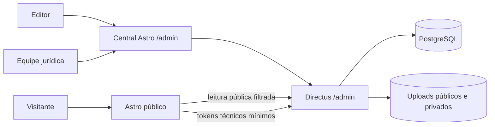

# Arquitetura

## Decisão principal

Astro e Directus não competem entre si neste portal:

- **Astro** renderiza o site, SEO, RSS, sitemap, formulários e a central de tarefas em `/admin`.
- **Directus** guarda conteúdo, usuários, funções, histórico e arquivos, além de oferecer o formulário editorial completo.
- **PostgreSQL** persiste todo dado estruturado.
- **Docker Compose** reproduz os serviços e mantém banco/uploads em volumes.

## Limites de segurança

- O navegador não recebe tokens técnicos.
- Leitura pública retorna somente itens publicados e campos permitidos.
- Formulários públicos passam pelo Astro, com validação, honeypot e rate limit.
- Mídia pública e anexos jurídicos ficam em pastas diferentes.
- Editor não exclui conteúdo.
- Jurídico não edita notícias nem gerencia usuários.
- Administração de usuários é exclusiva do Administrador.

## Conteúdo público

O portal publica notícias, benefícios, avisos, diretoria, conteúdo institucional, informações jurídicas, vídeos e cards sociais. Não existe coleção ou rota pública de editais, documentos, acordos ou convenções; `/convencoes` apenas redireciona para `/beneficios` para não deixar links antigos quebrados.

## Disponibilidade e recuperação

O site possui health check integrado. Banco e uploads usam volumes nomeados e entram juntos no backup verificado por checksum. Atualizações de imagem executam backup antes de recriar containers.
