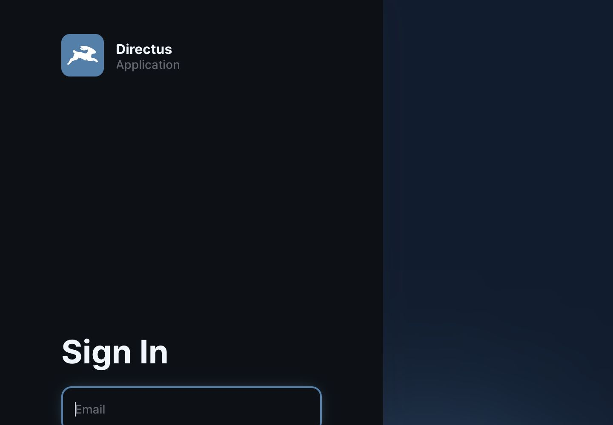
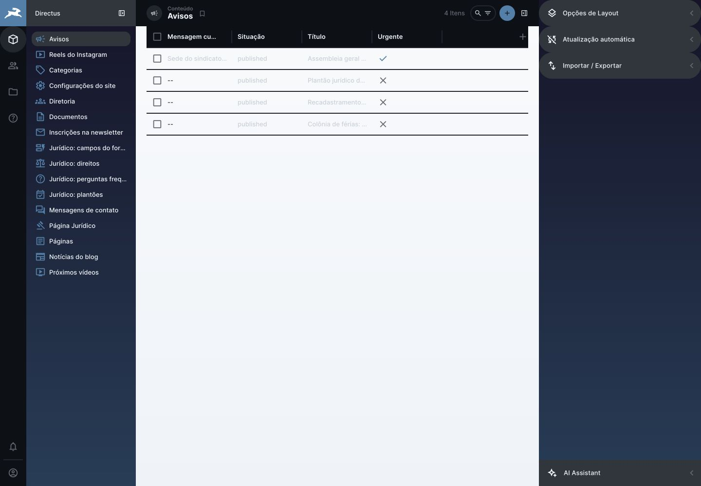
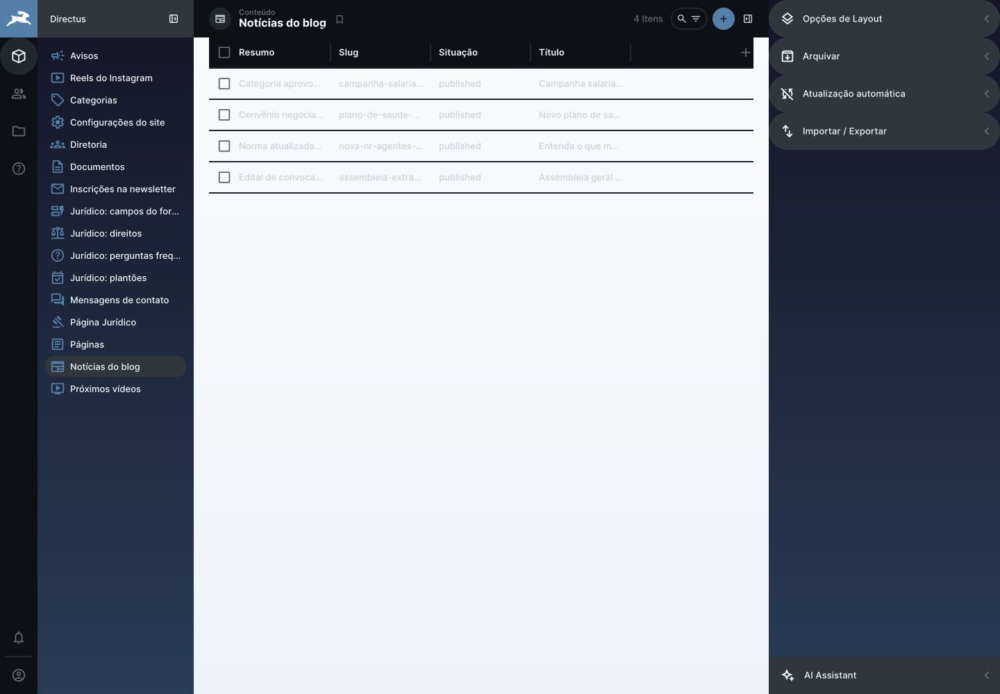
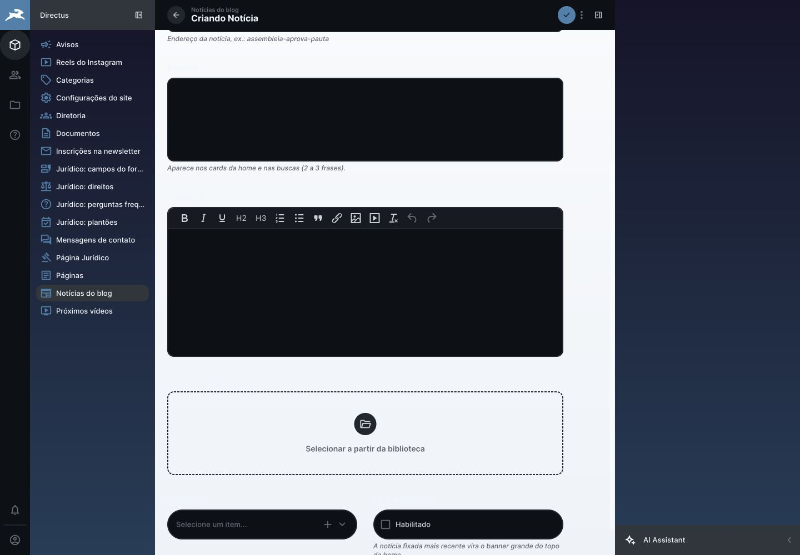
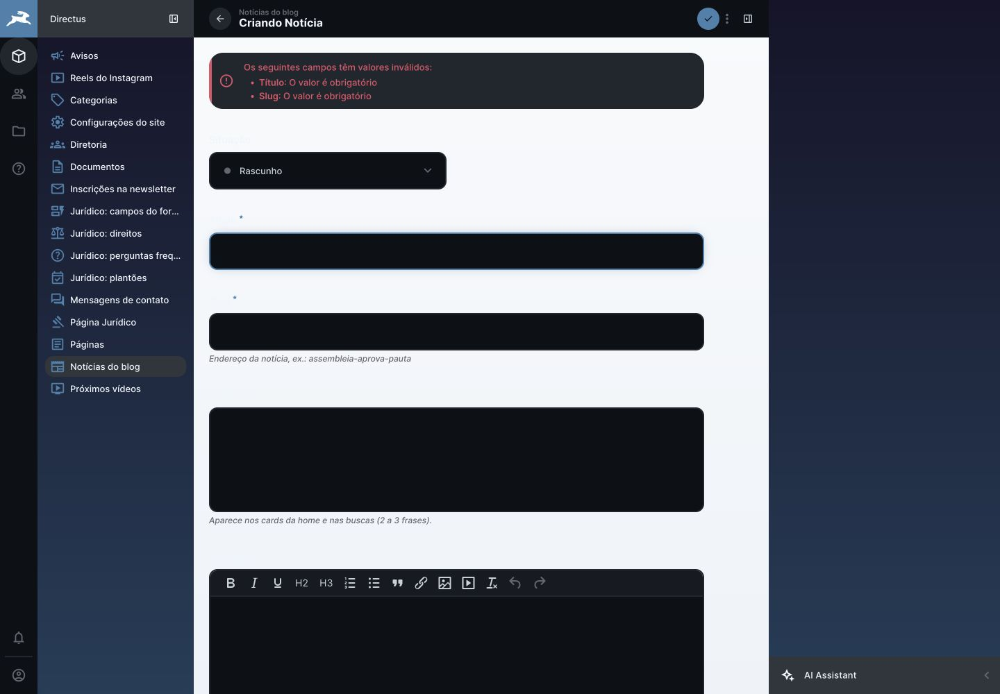
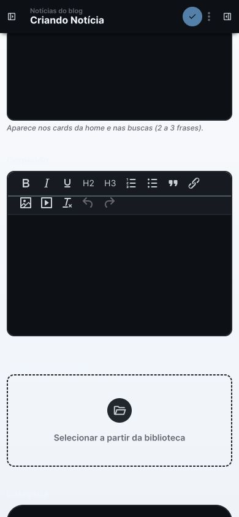
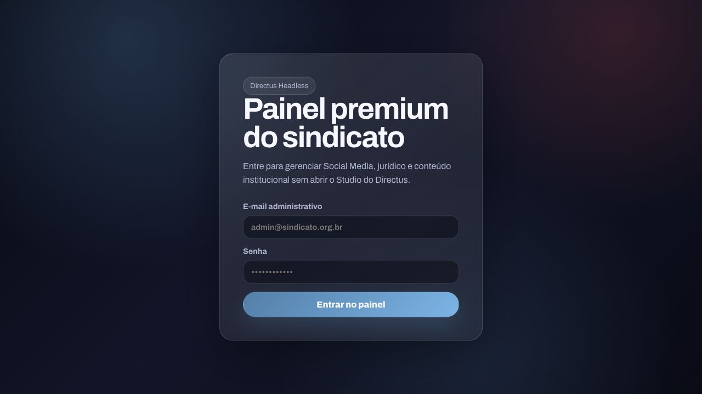
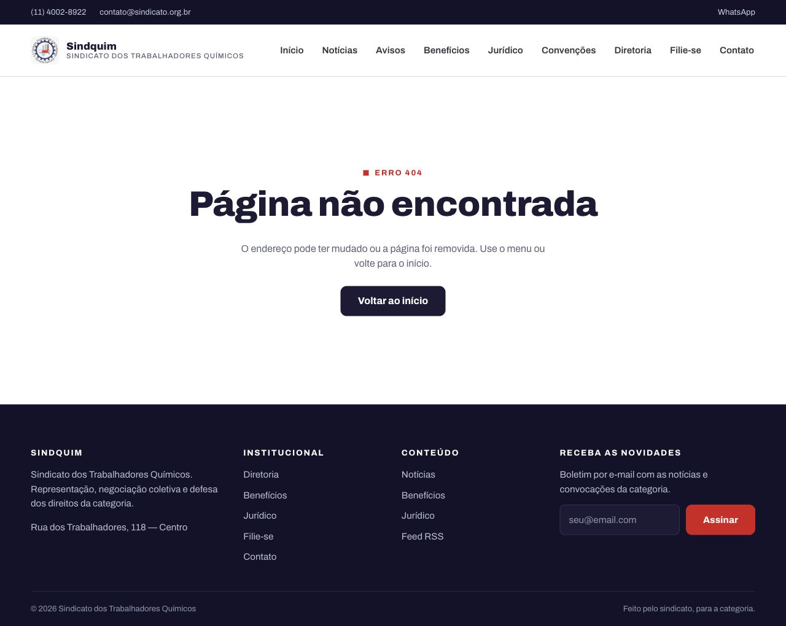
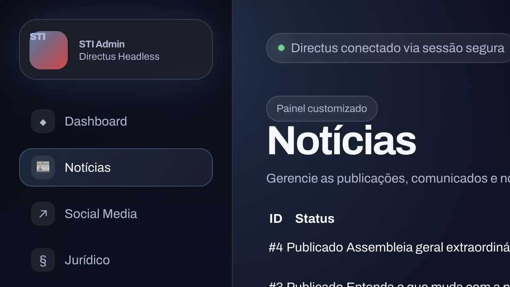
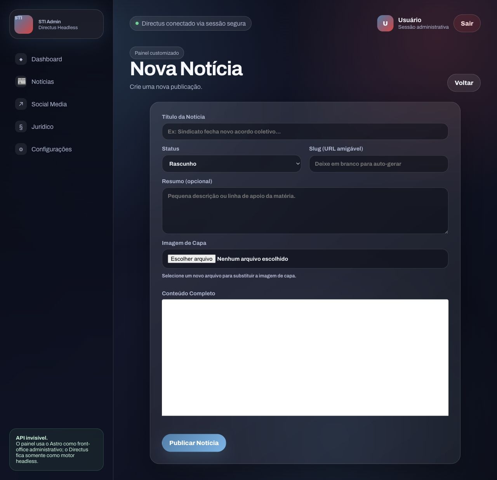

# Auditoria do fluxo editorial — Directus e painel Astro

**Data:** 21 de julho de 2026  
**Escopo:** autenticação, descoberta da tarefa, listagem, criação e validação de notícias  
**Ambiente:** cópia isolada da pilha em Docker, com banco e credenciais exclusivamente de teste  
**Viewports:** 1440 × 1000, 1280 × 720 e 390 × 844  
**Método:** revisão heurística baseada em evidência visual, inspeção da árvore semântica, testes reais com o perfil `Editor` e confirmação das falhas nos logs HTTP/Directus

## Resultado executivo

O fluxo atual **não atende** à meta de permitir que uma pessoa sem treinamento publique uma notícia com a simplicidade de postar uma foto em uma rede social.

O Directus contém os recursos corretos de CMS, mas está configurado com excesso de coleções, permissões perigosas, contraste quebrado e um formulário que começa fora da posição correta. O painel Astro tem aparência inicialmente mais simples, porém duplica o CMS, exibe módulos sem autorização, quebra no dashboard do Editor e ainda exige que a equipe mantenha autenticação, formulários, mídia, estados e auditoria em uma segunda interface.

Decisão recomendada:

- **Directus Data Studio:** único editor de Notícias, mídia, permissões, histórico, publicação e agenda;
- **Astro:** site público, preview autenticado e apenas módulos administrativos realmente específicos;
- **não manter dois editores de Notícias**;
- começar com configuração nativa do Directus e criar uma extensão mínima somente se o teste humano não atingir a meta.

## Limitações da auditoria

- Esta foi uma avaliação técnica e heurística, não um estudo com usuários reais.
- Não foram recrutadas crianças. A frase “até uma criança” foi tratada como uma meta de clareza extrema, não como definição literal do público.
- A base de produção não está no repositório. O teste recriou o modelo definido pelos scripts em um banco vazio e isolado.
- A validação definitiva de facilidade exige teste moderado com pessoas representativas que nunca usaram o sistema.

## Saúde das etapas observadas

1. **Login no Directus — atenção.** A tela está em inglês, o projeto ainda se chama “Directus” e, no viewport testado, o campo de senha fica abaixo da primeira dobra devido ao espaçamento excessivo.
2. **Página inicial do Editor — crítica.** O usuário entra em `Avisos`, não em Notícias, e vê mais de 16 coleções, inclusive Configurações, Documentos e todo o módulo Jurídico.
3. **Lista de Notícias no Directus — crítica.** A tabela prioriza resumo, slug e colunas técnicas; não há capa em destaque, cartões nem um ponto de entrada óbvio para a tarefa principal.
4. **Formulário atual do Directus — crítica.** A tela abre automaticamente cerca de 330 px rolada para baixo, escondendo status, título e slug. O editor rico domina a interface.
5. **Validação do Directus — crítica.** A mensagem em português é útil, mas rótulos ficam quase invisíveis pelo conflito de tema, o slug técnico é obrigatório e a ação de salvar é um ícone sem texto visível.
6. **Formulário Directus em celular — crítica.** O formulário abre no meio do conteúdo e a barra do editor ocupa quase toda a tela útil. A tarefa principal e as ações não ficam aparentes.
7. **Login do painel Astro — parcial.** A composição é clara, mas usa jargão (“Painel premium”, “Directus Headless”) e descreve decisões técnicas que não ajudam quem quer apenas publicar.
8. **Dashboard Astro como Editor — crítica.** A autenticação funciona, mas `/admin` responde 404 porque tenta consultar `chamados_juridicos`, coleção que o Editor não pode ler.
9. **Lista de Notícias no Astro — parcial.** É mais simples que a listagem atual do Directus, mas o menu mostra Social Media, Jurídico e Configurações sem considerar o papel do usuário.
10. **Formulário Astro — parcial.** A hierarquia é melhor, mas ainda expõe status e slug, não tem galeria/fonte/vídeo/agenda/preview e mantém uma segunda implementação do mesmo domínio editorial.

## Evidências visuais

### 1. Login do Directus

### 2. Página inicial sobrecarregada do Editor

### 3. Lista atual de Notícias no Directus

### 4. Formulário Directus abrindo no meio

### 5. Erros e contraste do formulário Directus

### 6. Directus no celular

### 7. Login do painel Astro

### 8. Dashboard Astro quebrado para o Editor

### 9. Lista de Notícias do Astro

### 10. Formulário de Notícias do Astro

## Achados priorizados

| Prioridade | Achado | Evidência | Impacto | Correção recomendada |
|---|---|---|---|---|
| P0 | O perfil Editor possui `create/read/update/delete` em 16 coleções editoriais, campos `*` e filtros vazios | Política consultada pela API; `scripts/directus-schema.mjs` | Exclusão ou alteração acidental de conteúdo e configurações | Reconstruir a Policy por tarefa, sem `delete`, sem campos sensíveis e com presets/validações |
| P0 | A Policy pública lê `posts`, `documentos` e `directus_files` sem filtro | API de permissões e teste anônimo | Rascunhos e arquivos privados podem ser acessados pela API | Publicar somente `status=published`; arquivos apenas em pastas explicitamente públicas |
| P0 | O dashboard Astro quebra para o Editor | Screenshot 8; HTTP 404; log 403 em `chamados_juridicos` | O primeiro acesso após login parece um site quebrado | Remover o editor de Notícias do Astro e tornar qualquer módulo remanescente sensível ao papel/policy |
| P1 | O Editor vê mais de 16 coleções e começa em Avisos | Screenshot 2 | Alta carga cognitiva e risco de erro | Mostrar apenas Notícias e Arquivos permitidos; entrada direta na lista/cartões de Notícias |
| P1 | Formulário abre rolado no meio | Screenshots 4 e 6; `scrollTop` inicial medido em cerca de 330 px | Usuário não encontra título nem contexto da tarefa | Remover foco automático do WYSIWYG e testar foco/scroll em desktop e celular |
| P1 | Custom CSS conflita com temas e reduz contraste | Screenshots 2–6; seletores globais em `directus-analytics-branding.mjs` | Rótulos e estados ficam ilegíveis | Remover seletores globais frágeis; usar tokens/temas nativos e validar WCAG AA |
| P1 | Slug é obrigatório e editável pelo Editor | Screenshots 4–5; metadados do campo | Expõe detalhe técnico e bloqueia publicação | Gerar no servidor, ocultar do Editor e manter estável depois da publicação |
| P1 | Ação principal do Directus é um ícone | Screenshot 5 | Ambiguidade para usuários iniciantes | Fornecer ações textuais inequívocas: Salvar rascunho, Ver antes e Publicar agora |
| P1 | Lista não usa capa nem layout editorial | Screenshot 3 | Dificulta reconhecer matérias visualmente | Preset de cartões com capa, título, status e data; filtros salvos simples |
| P1 | Não há galeria, fonte, vídeo, data programada ou preview | Metadados de `posts`; Flows vazios | O fluxo não cobre os requisitos definidos | Evoluir o modelo e os fluxos antes da mudança de interface |
| P1 | Login e marca do Directus permanecem em inglês/padrão | Screenshot 1; `/server/info` | Falta de confiança e clareza | Definir `project_name`, idioma padrão `pt-BR`, nota pública e marca de forma verificável |
| P2 | Painel Astro usa jargão técnico e menu fixo | Screenshots 7, 9 e 10 | Interface fala com desenvolvedor, não com editor | Se algum módulo Astro permanecer, usar linguagem de tarefa e navegação por autorização |
| P2 | Fluxo móvel não tem ação persistente nem hierarquia compacta | Screenshot 6 | Publicar pelo telefone se torna lento e confuso | Validar sticky actions, espaçamento, teclado e upload no Directus após reconfiguração |

## Avaliação de acessibilidade

Pontos positivos observados:

- o Directus fornece nomes acessíveis para muitos controles e estrutura semântica consistente;
- o login Astro tem rótulos associados aos campos;
- o site público contém link para pular ao conteúdo e landmarks semânticos.

Problemas observados:

- contraste insuficiente entre rótulos e o fundo do formulário Directus;
- ação principal visível apenas como ícone no Directus;
- a posição inicial do foco/scroll esconde o começo lógico do formulário;
- emojis/símbolos são usados como iconografia no painel Astro;
- imagem de capa da matéria pública usa `alt=""`, embora a capa possa transmitir informação;
- não existe teste automatizado de acessibilidade no projeto.

Gate recomendado:

- WCAG 2.2 AA para contraste, teclado, foco, nomes e mensagens de erro;
- axe sem violações críticas/sérias no login, lista, formulário e preview;
- fluxo completo executável apenas por teclado;
- zoom de 200% e viewport de 390 px sem perda de ação ou conteúdo.

## Fluxo editorial-alvo

1. O Editor entra e chega diretamente em **Notícias**.
2. Escolhe **Nova notícia**.
3. Vê primeiro apenas **Título**, **Foto de capa** e **Texto da notícia**.
4. Se quiser, abre **Mais opções** para categoria, resumo, galeria, fonte, YouTube e agendamento.
5. Usa ações textuais: **Salvar rascunho**, **Ver antes** e **Publicar agora**.
6. O sistema gera slug e resumo, seleciona `Geral` e impede publicação incompleta no servidor.
7. Depois de publicar, mostra confirmação clara e os links **Abrir notícia** e **Criar outra**.

## Critérios do teste humano de aceitação

Recrutar pelo menos cinco pessoas representativas da equipe, sem experiência prévia no painel. Cada participante recebe apenas a tarefa e os arquivos de uma matéria curta.

Tarefa principal:

- entrar no painel;
- criar notícia com título, texto e capa;
- adicionar três fotos à galeria, uma fonte e um link do YouTube;
- visualizar o preview;
- publicar;
- corrigir um erro e confirmar a versão pública.

Metas:

- 100% concluem sem ajuda bloqueante;
- mediana de até 3 minutos para título + texto + capa + publicação;
- até 5 minutos no cenário completo com galeria/fonte/vídeo;
- zero rascunho publicado sem intenção;
- zero slug editado manualmente;
- no máximo um erro recuperável por participante;
- confiança média de pelo menos 4/5;
- System Usability Scale de pelo menos 80.

Se o Directus configurado não atingir essas metas, deve-se identificar exatamente qual etapa falhou e criar uma extensão mínima apenas para essa etapa. O resultado do teste, e não preferência estética, decide se a extensão é necessária.

## Conclusão

A experiência desejada é viável com o Directus, mas não com a configuração atual. O maior ganho virá de reduzir o escopo do Editor, corrigir permissões, remover o CSS frágil, automatizar campos técnicos e transformar a tela de Notícias em um fluxo guiado. O painel Astro não deve continuar como um segundo CMS de Notícias.
