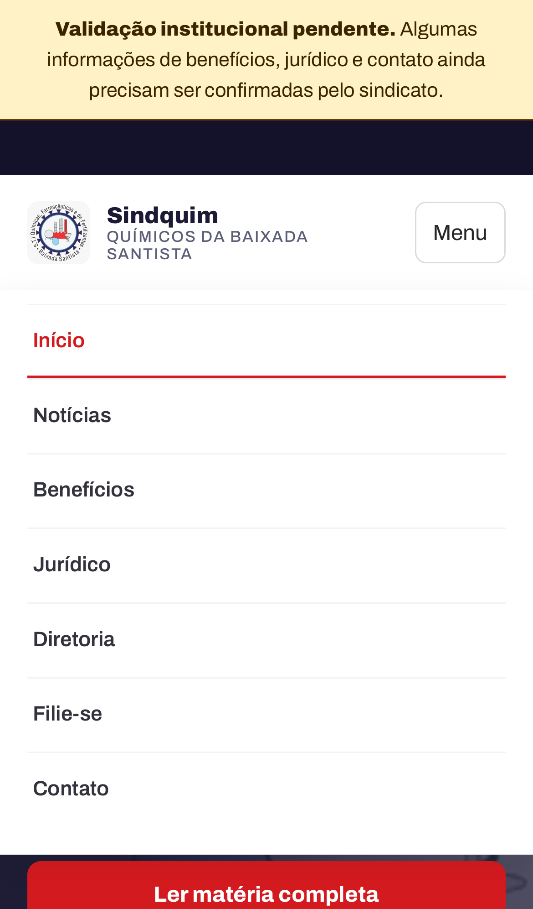
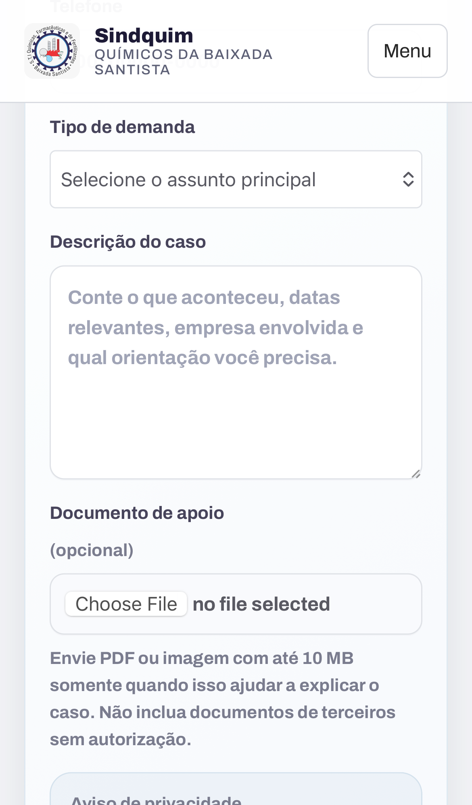

# Auditoria mobile com Playwright — 21/07/2026

## Escopo

Auditoria combinada de UX e acessibilidade básica no portal Docker em `http://localhost:4421`, usando Chromium e WebKit. Foram avaliados Android (Pixel 5), iPhone 13 e reflow em 320 px.

Objetivo do usuário: navegar, ler notícias, abrir o menu e usar formulários sem zoom involuntário, rolagem lateral ou alvos pequenos.

## Resultado

Após as correções, os 18 cenários automatizados passaram. As sete rotas públicas principais não apresentaram rolagem horizontal, erros de JavaScript ou erros no console nos perfis testados.

## Etapas e evidências

### 1. Entrada pela home — saudável

- Hierarquia forte e chamada principal imediatamente visível.
- Marca e botão do menu permanecem legíveis e tocáveis.
- O aviso institucional ocupa espaço considerável, mas comunica com clareza que partes do conteúdo aguardam validação.

### 2. Menu móvel aberto — saudável

- Navegação em coluna, rótulos diretos e áreas de toque com pelo menos 44 px.
- Estado expandido é comunicado por `aria-expanded`.
- “Avisos” não aparece no menu.

### 3. Lista de notícias — saudável

- Título, categoria, data, imagem e chamada da matéria mantêm a ordem de leitura.
- Cards passam para uma coluna e não criam rolagem lateral.
- A repetição da marca institucional nas capas é coerente como solução provisória, mas futuras fotografias autorizadas aumentariam a diferenciação visual.

### 4. Formulário jurídico — saudável com ressalva operacional

- Campos usam 16 px ou mais, evitando o zoom automático do Safari móvel.
- Seletor, campos e ações têm ao menos 44 px de altura; o seletor foi fixado em 48 px no WebKit.
- Aviso de privacidade e consentimento continuam necessários para o fluxo completo.
- O texto nativo do seletor de arquivo depende do idioma do sistema e do navegador.

### 5. Benefícios em 320 px — saudável

- A grade se reduz a uma coluna sem ampliar a página.
- O marcador interno `[DEMONSTRAÇÃO]` foi convertido em “Conteúdo em validação”, mais claro e sem quebra tipográfica ruim.
- A chamada principal permanece visível antes da dobra.

## Problemas encontrados e corrigidos

1. Campos herdavam 14,72 px e poderiam acionar zoom automático no iPhone; agora usam no mínimo 16 px.
2. O formulário de newsletter forçava o rodapé além de 320 px; agora se empilha e respeita o contêiner.
3. Títulos longos com marcador demonstrativo ampliavam páginas compactas; agora quebram com segurança e o marcador recebe uma apresentação própria.
4. O `select` jurídico tinha 23 px no WebKit; agora possui altura explícita de 48 px.
5. Vitest tentava interpretar a suíte E2E; a configuração agora separa testes unitários e Playwright.

## Limites da evidência

- A emulação não substitui testes em aparelhos físicos com teclado, leitor de tela e diferentes níveis de zoom.
- Não foi realizada certificação completa WCAG nem teste com VoiceOver/TalkBack.
- Condições de rede lenta e consumo de dados ainda não fazem parte da suíte.
