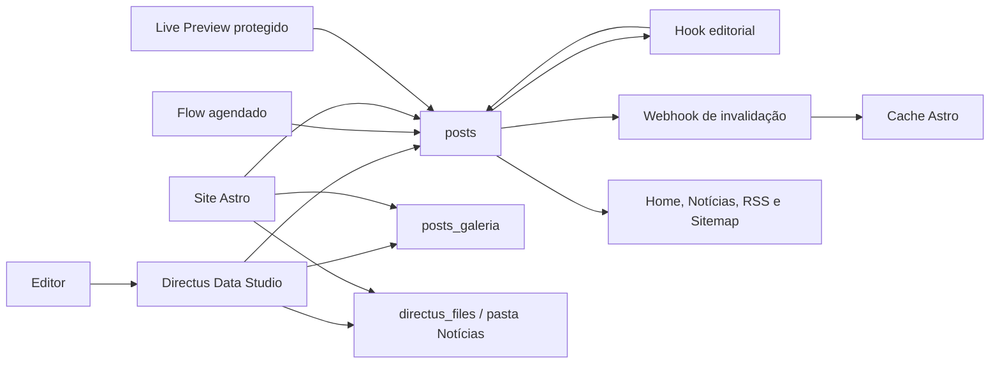

# Plano de Implementação — Publicação de Notícias Intuitiva no Directus

**Data:** 20/07/2026  
**Status:** substituído quanto à arquitetura, baseline técnico, segurança, deploy e ordem de execução pelo [plano mestre validado em Docker e UX](./2026-07-21-plano-mestre-validado-docker-ux.md); manter este documento como catálogo funcional  
**Destino:** permitir que uma pessoa sem treinamento publique uma notícia pronta em até três minutos, sem ajuda, usando o Data Studio nativo do Directus.

> Este documento é um plano. Nenhuma etapa destrutiva deve ser executada sem passar pelos gates de backup, homologação e rollback descritos abaixo.

> **Importante:** para executar o trabalho, seguir primeiro o plano mestre de 21/07/2026. Este documento não contempla sozinho todos os bloqueadores encontrados na auditoria do checkout e da implantação ativa.

## 1. Resultado esperado

Ao final da implementação, um Editor deverá conseguir:

1. entrar no Directus com uma conta individual;
2. abrir uma grade visual de Notícias;
3. clicar em **Nova notícia**;
4. preencher apenas **Título**, **Foto de capa** e **Texto**;
5. opcionalmente abrir **Mais opções** para escolher categoria, ajustar resumo, adicionar galeria, fonte externa, vídeo ou agendamento;
6. salvar como Rascunho ou publicar por uma ação explícita;
7. receber confirmação clara e acessar a notícia publicada;
8. atualizar ou arquivar a notícia sem possuir permissão para exclusão definitiva.

O site público deverá exibir imediatamente o conteúdo publicado, com capa otimizada, galeria, vídeo, fonte, autor institucional, SEO, RSS e sitemap coerentes.

## 2. Decisões de produto já fechadas

- O editor principal será o **Data Studio nativo do Directus**, não o formulário Astro em `/admin/noticias`.
- O dispositivo prioritário para edição será o computador; o celular continuará funcional.
- O formulário terá uma única página e um grupo recolhido **Mais opções**.
- Os únicos campos principais serão Título, Foto de capa e Texto.
- O editor visual terá apenas títulos, negrito, itálico, listas, links, citação e desfazer/refazer.
- Toda notícia começará como Rascunho.
- A publicação será uma ação explícita; a prévia será opcional.
- A Foto de capa será opcional no Rascunho e obrigatória para Publicar ou Agendar.
- O resumo será automático, mas editável.
- O slug será automático e não mudará após a primeira publicação.
- A notícia mais recente será o destaque padrão da home; apenas Administradores poderão fixar outra.
- A categoria padrão será Geral.
- As categorias fixas serão: Geral, Campanha Salarial, Assembleias, Direitos, Benefícios, Jurídico e Comunicados.
- A Fonte externa será opcional e exibida ao final da notícia.
- A Galeria terá até vinte fotos, ordenação manual, legenda e crédito opcionais.
- O Vídeo será opcional e informado por URL do YouTube.
- A descrição acessível da Foto de capa usará automaticamente o título da notícia.
- A publicação poderá ser imediata ou agendada.
- O autor público será institucional; o usuário real será preservado apenas para auditoria.
- Editores poderão arquivar, mas não excluir definitivamente.
- Alterações em notícias publicadas entrarão no ar após confirmação.
- O histórico ficará disponível somente para Administradores.
- O editor verá Notícias, Avisos e os arquivos editoriais permitidos.
- A área de documentos, convenções, acordos e editais será removida do produto ativo após backup.

## 3. Estado atual observado

### 3.1 Directus e schema

O projeto usa Directus 11 com SQLite e uploads locais. O bootstrap principal está em `scripts/directus-schema.mjs`.

A coleção `posts` possui atualmente:

- `status`: `draft`, `published` ou `archived`;
- `titulo`;
- `slug` obrigatório e manual;
- `resumo` manual;
- `conteudo` em WYSIWYG;
- `imagem` como arquivo único;
- `categoria`;
- `fixado_banner`;
- `date_created`.

Ainda não existem campos para agendamento, data real de publicação, fonte externa, vídeo, auditoria completa ou galeria com metadados.

### 3.2 Permissões

A função `Editor` atualmente recebe `create`, `read`, `update` e `delete` em todas as coleções declaradas no schema. A função também enxerga conteúdo que não pertence ao fluxo editorial simples.

O helper `garantirPermissao()` apenas ignora uma permissão já existente. Portanto, ele não corrige permissões antigas e não é suficiente para endurecer uma instalação existente.

### 3.3 Painel duplicado

O Astro mantém um editor próprio em:

- `site/src/pages/admin/noticias/index.astro`;
- `site/src/pages/admin/noticias/[id].astro`;
- `site/src/pages/api/admin/noticias/salvar.ts`;
- `site/src/lib/adminNoticias.ts`.

Esse editor usa Quill por CDN, possui fluxo próprio de upload e repete regras que deverão passar a existir no Directus.

### 3.4 Site público

O site consulta `posts` em `site/src/lib/directus.ts`, usa `date_created` como data editorial e mantém cache em memória por sessenta segundos.

As principais superfícies consumidoras são:

- home: `site/src/pages/index.astro`;
- cartões: `site/src/components/NoticiaCard.astro`;
- listagem: `site/src/pages/noticias/index.astro`;
- detalhe: `site/src/pages/noticias/[slug].astro`;
- RSS: `site/src/pages/rss.xml.ts`;
- sitemap: `site/src/pages/sitemap.xml.ts`.

### 3.5 Documentos existentes

Na verificação feita durante o planejamento, a instância ativa respondeu com quatro notícias e três registros na coleção `documentos`. As contagens deverão ser refeitas imediatamente antes da migração.

### 3.6 Lacunas de segurança relacionadas a arquivos

A política pública atual recebe leitura irrestrita de `directus_files`. Isso deve ser auditado antes de ampliar o uso de imagens, pois o mesmo Directus também armazena anexos jurídicos que não podem se tornar públicos por engano.

## 4. Arquitetura-alvo



### 4.1 Distribuição de responsabilidades

**Directus Data Studio**

- formulário editorial;
- grade de cartões e filtros;
- upload e ordenação de mídia;
- permissões e auditoria;
- Live Preview;
- confirmação das ações editoriais.

**Hook editorial versionado**

- gerar slug;
- gerar resumo quando ainda não houver ajuste editorial;
- normalizar URL do YouTube;
- validar transições de status;
- exigir capa na publicação;
- preservar data e slug de uma notícia publicada;
- impedir a vigésima primeira foto.

**Flows do Directus**

- publicar itens agendados;
- chamar o endpoint seguro de invalidação do cache após publicação, atualização ou arquivamento.

**Astro**

- renderizar conteúdo público;
- fornecer prévia protegida de Rascunhos e Agendadas;
- transformar imagens pelo endpoint local de assets do Directus;
- renderizar galeria e vídeo sem API externa de geração de mídia;
- atualizar SEO, RSS e sitemap.

## 5. Modelo de domínio e estados

O vocabulário canônico está em `CONTEXT.md`.

### 5.1 Máquina de estados

| Origem | Ação | Destino | Validações |
| --- | --- | --- | --- |
| novo | Salvar rascunho | `draft` | título pode ser exigido pelo Studio; capa não é obrigatória |
| `draft` | Publicar agora | `published` | título, conteúdo e capa obrigatórios; fonte válida quando ativada |
| `draft` | Agendar | `scheduled` | mesmas validações da publicação e data futura obrigatória |
| `scheduled` | horário alcançado | `published` | Flow define a data efetiva e invalida cache |
| `scheduled` | Cancelar agendamento | `draft` | data pode ser preservada ou limpa pelo hook |
| `published` | Atualizar notícia | `published` | slug e primeira data de publicação permanecem estáveis |
| `published` | Arquivar | `archived` | notícia deixa site, RSS e sitemap |
| `draft` | Arquivar | `archived` | sem publicação pública |
| `archived` | Restaurar | `draft` | ação administrativa, fora do caminho simples do Editor |

Estados válidos: `draft`, `scheduled`, `published`, `archived`.

### 5.2 Data editorial

- `date_created` continuará sendo dado técnico de auditoria.
- `data_publicacao` passará a controlar ordenação, exibição, RSS e JSON-LD.
- Notícias publicadas existentes receberão `data_publicacao = date_created` no backfill.
- Notícias imediatamente publicadas receberão `$NOW` quando ainda não houver data.
- Notícias agendadas preservarão o horário escolhido.
- Atualizações posteriores não mudarão `data_publicacao`.
- `date_updated` será usado como `dateModified` e `lastmod`.

## 6. Modelo de dados proposto

### 6.1 Coleção `posts`

| Campo | Tipo | Studio | Regra |
| --- | --- | --- | --- |
| `id` | chave existente | oculto | preservado |
| `status` | string | ação editorial simplificada | padrão `draft`; quatro estados válidos |
| `titulo` | string | Título | obrigatório |
| `slug` | string único | oculto para Editor, visível ao Administrador | gerado no primeiro save e preservado |
| `resumo` | text | Mais opções | gerado quando vazio; editável |
| `conteudo` | text/HTML | Texto | obrigatório para publicar ou agendar |
| `imagem` | M2O `directus_files` | Foto de capa | obrigatória somente ao publicar/agendar |
| `categoria` | M2O `categorias` | Mais opções | Geral por padrão |
| `fixado_banner` | boolean | oculto para Editor | Administrador apenas |
| `tem_fonte_externa` | boolean | Mais opções | revela os dois campos de fonte |
| `fonte_nome` | string | condicional | obrigatório quando fonte externa estiver ativa |
| `fonte_url` | string | condicional | URL HTTP/HTTPS válida quando ativa |
| `video_youtube_url` | string | Mais opções | somente URL YouTube/youtu.be válida |
| `data_publicacao` | timestamp | Mais opções | futura quando agendada; somente leitura após publicação |
| `galeria` | alias O2M | Mais opções | até vinte itens ordenáveis |
| `date_created` | timestamp especial | oculto | auditoria |
| `date_updated` | timestamp especial | oculto | auditoria e SEO |
| `user_created` | usuário especial | oculto | auditoria |
| `user_updated` | usuário especial | oculto | auditoria |

### 6.2 Coleção `posts_galeria`

Usar uma coleção de junção explícita, em vez de uma relação simples de arquivos, porque legenda, crédito e ordem pertencem à participação da foto naquela notícia.

| Campo | Tipo | Regra |
| --- | --- | --- |
| `id` | inteiro incremental | chave primária |
| `post` | M2O `posts` | obrigatório; exclusão em cascata somente se o post for excluído por Administrador |
| `arquivo` | M2O `directus_files` | obrigatório; aceitar somente imagens |
| `ordem` | inteiro | usado para arrastar e ordenar |
| `legenda` | string/text | opcional |
| `credito` | string | opcional |

Configurar `sort_field = ordem` e uma interface O2M no campo alias `posts.galeria`.

### 6.3 Categorias fixas

O setup deverá garantir, por slug, exatamente as categorias editoriais aprovadas:

| Nome | Slug |
| --- | --- |
| Geral | `geral` |
| Campanha Salarial | `campanha-salarial` |
| Assembleias | `assembleias` |
| Direitos | `direitos` |
| Benefícios | `beneficios` |
| Jurídico | `juridico` |
| Comunicados | `comunicados` |

Migração:

- reutilizar os registros existentes por identidade natural;
- renomear `Assembleia` para `Assembleias` sem trocar o ID associado às notícias;
- impedir que Editores criem, alterem ou excluam categorias;
- aplicar Geral como preset de criação da política Editor;
- não apagar categorias antigas automaticamente se ainda estiverem relacionadas; emitir relatório e tratar cada uma explicitamente.

## 7. Especificação da experiência no Data Studio

### 7.1 Navegação

O Editor deverá enxergar apenas:

- Notícias;
- Avisos;
- Arquivos da pasta editorial autorizada.

Categorias continuarão disponíveis como relação de leitura, mas não precisam aparecer como módulo principal.

### 7.2 Grade de Notícias

Criar um preset vinculado à função Editor:

- layout `cards`;
- imagem: `imagem`;
- título: `{{titulo}}`;
- subtítulo: situação e data de publicação;
- ordenação: `-data_publicacao`, com fallback para `-date_created` no período de migração;
- tamanho de cartão confortável em desktop;
- ação principal claramente nomeada **Nova notícia**.

Criar três filtros/bookmarks:

- Rascunhos: `status = draft`;
- Publicadas: `status = published`;
- Agendadas: `status = scheduled`.

Usar somente propriedades reais de `directus_presets`: `bookmark`, `filters`, `layout`, `layout_query` e `layout_options`. Não usar campos inexistentes como `filter` singular.

### 7.3 Ordem dos campos

Campos visíveis ao abrir uma notícia:

1. Título;
2. Foto de capa;
3. Texto;
4. grupo recolhido **Mais opções**;
5. ações Salvar rascunho, Pré-visualizar, Publicar agora ou Agendar.

Dentro de **Mais opções**:

1. Categoria;
2. Resumo;
3. Galeria;
4. Fonte externa;
5. Vídeo do YouTube;
6. Agendamento.

### 7.4 WYSIWYG

Remover da barra:

- cores;
- fontes;
- tamanhos arbitrários;
- underline e strike;
- tabelas;
- HTML/source code;
- upload de imagem dentro do texto;
- mídia genérica.

Manter:

- `h2` e `h3`;
- negrito e itálico;
- listas numerada e com marcadores;
- citação;
- link;
- remover formatação;
- desfazer e refazer.

Definir a pasta padrão de uploads como **Notícias**.

### 7.5 Ações editoriais

Fazer primeiro um spike curto na versão exata do Directus instalada:

1. validar se configuração nativa, condições e Flows manuais atendem aos rótulos e à navegação pós-publicação;
2. se o Studio nativo não conseguir oferecer os botões e o retorno à lista, implementar uma extensão mínima de interface, dentro do Data Studio;
3. não criar um módulo editorial paralelo.

A extensão mínima, se necessária, deverá apenas:

- traduzir o status em ações compreensíveis;
- salvar o item com o status correto;
- pedir confirmação ao atualizar uma notícia já publicada;
- abrir a Live Preview;
- voltar à grade após publicar;
- mostrar os links **Ver no site** e **Criar outra notícia**.

Toda regra de integridade continuará no hook de servidor. A interface nunca será a única barreira.

## 8. Automações e validações

### 8.1 Estratégia

Usar:

- **hook Filter bloqueante** para normalização e validações que precisam ocorrer na mesma transação;
- **Flow agendado** para promoção de `scheduled` para `published`;
- **Flow Action não bloqueante** para invalidar o cache após a transação.

Essa separação mantém regras críticas testáveis em código e automações operacionais visíveis no Directus.

### 8.2 Slug

No primeiro save:

1. normalizar Unicode;
2. remover acentos;
3. converter para minúsculas;
4. substituir separadores por hífen;
5. remover caracteres inválidos;
6. consultar colisões;
7. adicionar sufixo `-2`, `-3` e assim por diante quando necessário.

Em updates:

- preservar qualquer slug já existente;
- permitir alteração apenas por Administrador;
- nunca recalcular automaticamente após publicação.

Adicionar índice único no banco somente depois de auditar e corrigir colisões existentes.

### 8.3 Resumo

Quando `resumo` estiver vazio:

1. sanitizar o HTML do conteúdo;
2. escolher o primeiro parágrafo textual significativo;
3. normalizar espaços;
4. limitar pelo tamanho visual aprovado para cartões e metadados;
5. cortar em limite de palavra;
6. salvar o resultado no próprio campo `resumo`.

Se o Editor alterar o resumo, o hook deverá preservá-lo. Limpar o campo explicitamente permitirá regenerá-lo no próximo save.

### 8.4 Publicação imediata

Ao trocar para `published`:

- exigir título não vazio;
- exigir conteúdo textual real, não apenas HTML vazio;
- exigir Foto de capa;
- validar Fonte externa se ativada;
- validar URL do YouTube se preenchida;
- definir `data_publicacao = $NOW` somente quando ainda não houver data;
- preservar slug;
- emitir evento para invalidação de cache.

### 8.5 Agendamento

Ao trocar para `scheduled`:

- aplicar todas as validações da publicação;
- exigir `data_publicacao > $NOW`;
- deixar a notícia invisível no site público.

Criar Flow com intervalo pequeno e previsível:

1. buscar `status = scheduled` e `data_publicacao <= $NOW`;
2. atualizar em lote para `published`;
3. registrar quantidade promovida;
4. disparar invalidação do cache;
5. ser idempotente em execuções repetidas.

### 8.6 Galeria

No create da relação `posts_galeria`:

- validar que o arquivo é imagem;
- contar itens existentes da notícia;
- rejeitar o vigésimo primeiro item com mensagem em português;
- normalizar `ordem` quando ausente;
- não apagar o arquivo físico ao remover somente a relação.

### 8.7 Foto de capa e enquadramento

- manter o arquivo original no Directus;
- continuar entregando WebP por `urlImagem()`;
- usar `fit=cover` nas proporções do site;
- validar se o Directus 11 instalado respeita o focal point do arquivo;
- expor **Ajustar enquadramento** somente quando o recurso nativo estiver disponível;
- usar o título da notícia como `alt`, conforme decisão de produto.

## 9. Permissões e segurança

### 9.1 Matriz-alvo da política Editor

| Coleção | Create | Read | Update | Delete | Observação |
| --- | --- | --- | --- | --- | --- |
| `posts` | sim | sim | sim | não | campos técnicos e `fixado_banner` excluídos da permissão |
| `posts_galeria` | sim | sim | sim | sim | delete remove associação, não o arquivo |
| `categorias` | não | sim | não | não | lista fixa |
| `avisos` | sim | sim | sim | não | arquivar em vez de excluir |
| `directus_files` | sim | sim | sim | não | somente pasta editorial e arquivos autorizados |
| `directus_folders` | não | sim | não | não | somente pastas necessárias |
| demais coleções | não | não | não | não | ficam ocultas |

### 9.2 Campos permitidos em `posts`

Editor poderá gravar:

- `status`;
- `titulo`;
- `resumo`;
- `conteudo`;
- `imagem`;
- `categoria`;
- `tem_fonte_externa`;
- `fonte_nome`;
- `fonte_url`;
- `video_youtube_url`;
- `data_publicacao` enquanto Rascunho ou Agendada;
- relação `galeria`.

Editor não poderá gravar:

- `id`;
- `slug`;
- `fixado_banner`;
- `date_created`;
- `date_updated`;
- `user_created`;
- `user_updated`.

### 9.3 Arquivos

Criar uma pasta Directus **Notícias** e configurar capa/WYSIWYG/galeria para usá-la.

Antes do rollout:

- mapear pastas e arquivos existentes;
- garantir que anexos jurídicos permaneçam fora da leitura pública e editorial;
- substituir a leitura pública irrestrita de `directus_files` por filtros que liberem somente mídias públicas;
- testar diretamente que um visitante não autenticado não consegue baixar um anexo jurídico por ID;
- testar que um Editor não enxerga anexos jurídicos no seletor de arquivos.

Esse gate é obrigatório e não deve ser adiado para depois da publicação.

### 9.4 Contas

- uma conta por pessoa;
- sem credencial compartilhada;
- Administrador e Editor em políticas diferentes;
- auditoria por `user_created` e `user_updated`;
- procedimento documentado para desativar acesso sem apagar histórico.

## 10. Live Preview

### 10.1 Rota

Criar uma rota Astro protegida por ID, por exemplo:

`/preview/noticias/<id>`

Não depender do slug, pois a notícia pode ser nova ou ainda estar em Rascunho.

### 10.2 Segurança

- usar um segredo de preview separado do token administrativo;
- usar no servidor Astro um token Directus dedicado, somente leitura, limitado a Notícias, Galeria, Categorias e arquivos editoriais;
- nunca enviar esse token ao navegador;
- validar o segredo antes de consultar o Directus;
- responder `Cache-Control: no-store`;
- aplicar `noindex,nofollow`;
- não incluir a rota em RSS ou sitemap;
- registrar tentativa inválida sem registrar o segredo.

Variáveis novas:

- `DIRECTUS_PREVIEW_TOKEN`;
- `DIRECTUS_PREVIEW_SECRET`;
- `CACHE_INVALIDATION_SECRET`.

Atualizar `deploy/.env.example`, `site/.env.example`, `deploy/docker-compose.yml` e documentação operacional.

### 10.3 Live Preview no Studio

Configurar a URL da coleção `posts` para usar o ID e o segredo. Se o versionamento de conteúdo do Directus for habilitado, incluir `{{$version}}` somente após a rota Astro aceitar e validar a versão solicitada.

O Editor não verá o histórico bruto. Administradores poderão consultar revisões e versões conforme permissões restritas.

## 11. Invalidação de cache

O cache atual pode atrasar uma publicação em até sessenta segundos. Para que a confirmação do Studio corresponda ao site:

1. ampliar `site/src/lib/cache.ts` com invalidação por chave ou prefixo;
2. criar endpoint interno autenticado para invalidar chaves de notícias;
3. invalidar `post-banner`, `posts-*`, `posts-total` e `post-<slug>`;
4. disparar o endpoint via Flow após publicar, atualizar, arquivar ou promover agendamento;
5. manter o TTL como fallback de resiliência;
6. responder sem revelar quais chaves existem;
7. testar segredo incorreto, repetição e indisponibilidade do Astro.

Falha na invalidação não deverá desfazer a publicação. O Flow deverá registrar o erro e o TTL continuará garantindo convergência.

## 12. Alterações no site público

### 12.1 Tipos e consultas

Modificar `site/src/lib/tipos.ts`:

- adicionar `scheduled` ao status de Notícia;
- criar tipos `FotoGaleria` e relação da Galeria;
- adicionar fonte, vídeo, data editorial e auditoria ao tipo `Post`;
- remover `Documento` e `documentos` do `SchemaDirectus` após o gate destrutivo.

Modificar `site/src/lib/directus.ts`:

- incluir os novos campos e relações em `CAMPOS_POST`;
- ordenar por `data_publicacao`;
- manter filtro público estrito `status = published`;
- garantir que Agendadas e Arquivadas nunca sejam retornadas;
- criar leitura autenticada separada para Preview;
- remover `getDocumentos()`;
- limitar campos aninhados para não expor metadados desnecessários de arquivos.

### 12.2 Página da notícia

Modificar `site/src/pages/noticias/[slug].astro`:

- usar `data_publicacao` como data publicada;
- usar `date_updated` como data modificada;
- renderizar Foto de capa com `alt={post.titulo}`;
- renderizar vídeo opcional após o texto;
- renderizar Galeria em grade após o texto/vídeo;
- renderizar Fonte externa no final;
- exibir autor institucional;
- manter sanitização do HTML;
- preencher `NewsArticle.author`, `datePublished`, `dateModified` e todas as imagens no JSON-LD.

### 12.3 Galeria

Criar `site/src/components/GaleriaNoticia.astro`:

- grade responsiva;
- imagens lazy-loaded;
- Directus assets em WebP e dimensões adequadas;
- legenda e crédito quando existentes;
- ampliação por `<dialog>` ou solução local equivalente;
- fechamento por botão, `Escape` e clique controlado;
- devolução de foco ao disparador;
- navegação por teclado;
- sem dependência de API ou serviço externo de mídia.

### 12.4 Vídeo

Criar `site/src/components/VideoNoticia.astro`:

- extrair e validar o ID de URLs `youtube.com` e `youtu.be`;
- reutilizar `lite-youtube-embed` já instalado;
- não iniciar automaticamente;
- usar título acessível;
- não renderizar nada quando a URL for inválida.

### 12.5 Cartões, home, RSS e sitemap

Modificar:

- `site/src/components/NoticiaCard.astro`: alt automático e data editorial;
- `site/src/pages/index.astro`: banner e listagem por data editorial;
- `site/src/pages/noticias/index.astro`: paginação preservada;
- `site/src/pages/rss.xml.ts`: `pubDate = data_publicacao`;
- `site/src/pages/sitemap.xml.ts`: remover `/convencoes` e usar `date_updated` no `lastmod`;
- `site/src/styles/global.css`: Galeria, lightbox, Fonte e Vídeo.

### 12.6 Autor institucional

Definir o autor público em uma constante central do projeto, não em campo editável. O usuário Directus continuará registrado apenas nos campos de auditoria.

## 13. Retirada do editor Astro duplicado

### 13.1 Remover

- `site/src/pages/admin/noticias/[id].astro`;
- `site/src/pages/api/admin/noticias/salvar.ts`;
- `site/src/lib/adminNoticias.ts`;
- Quill por CDN e qualquer documentação específica desse fluxo.

### 13.2 Preservar compatibilidade de links

Substituir `site/src/pages/admin/noticias/index.astro` por uma rota mínima de redirecionamento para a coleção Notícias no Directus, ou criar redirecionamento equivalente centralizado.

Para links antigos com ID:

- redirecionar `/admin/noticias/<id>` para o item correspondente no Directus durante uma janela de compatibilidade;
- remover a compatibilidade somente depois de confirmar que não há favoritos ou documentação apontando para a rota antiga.

### 13.3 Atualizar o painel Astro restante

Modificar `site/src/layouts/AdminLayout.astro`:

- fazer o link Notícias abrir o Directus;
- remover textos que afirmam que o Directus é invisível;
- deixar claro que o Astro administra módulos específicos e o Directus administra Notícias/Avisos.

O dashboard Astro poderá continuar mostrando contagens ou resumos de notícias, desde que não ofereça edição duplicada.

## 14. Remoção de documentos, convenções e acordos

### 14.1 Princípio de segurança

A remoção da coleção não deve ocorrer dentro do bootstrap idempotente comum. Criar uma migração destrutiva explícita, com `--dry-run`, confirmação nominal e verificação de backup.

### 14.2 Backup obrigatório

Antes de qualquer remoção:

1. executar `scripts/backup-lxc200-data.sh`;
2. validar o `tar.gz` com `tar -tzf`;
3. registrar caminho, timestamp e tamanho;
4. exportar a coleção `documentos` em JSON;
5. exportar metadados dos `directus_files` relacionados;
6. incluir os arquivos físicos correspondentes em um pacote focado;
7. testar a leitura de ao menos um PDF a partir do pacote;
8. recontar registros e arquivos imediatamente antes da exclusão.

### 14.3 Remoção no código ativo

- retirar `documentos` de `COLECOES` e `LEITURA_PUBLICA`;
- remover `Documento` e `SchemaDirectus.documentos`;
- remover `getDocumentos()`;
- remover `site/src/pages/convencoes.astro`;
- remover `/convencoes` do sitemap e de qualquer navegação;
- remover dados de exemplo e testes relacionados;
- atualizar README, arquitetura, conteúdo Directus, site README e plano mestre atual.

### 14.4 Remoção no Directus

A migração explícita deverá:

1. listar registros e relações no `--dry-run`;
2. verificar se os arquivos são usados por outra coleção;
3. remover permissões de `documentos`;
4. excluir a coleção `documentos`;
5. excluir somente arquivos órfãos incluídos no backup;
6. verificar que `/items/documentos` não está mais disponível;
7. verificar que anexos jurídicos e outras mídias permanecem intactos.

### 14.5 Legado e documentação histórica

- remover referências executáveis à área de documentos no mockup raiz e no tema WordPress legado, incluindo CPT, archive e links de menu;
- preservar documentos históricos em `docs/superpowers/` como registro de decisões antigas, marcando-os como substituídos quando forem confundíveis com a arquitetura atual;
- não remover menções a **convênios/benefícios**, pois são um conceito diferente de convenções e acordos coletivos, conforme `CONTEXT.md`.

## 15. Estrutura de scripts recomendada

### 15.1 Criar

- `scripts/lib/directus-admin.mjs`: cliente REST, login e helpers de upsert;
- `scripts/setup-directus-noticias.mjs`: schema editorial, categorias, metadados, presets, permissões e Flows;
- `scripts/setup-directus-noticias.test.mjs`: testes unitários das definições e payloads;
- `scripts/migrate-noticias-editorial.mjs`: auditoria e backfill aditivo;
- `scripts/remover-documentos-directus.mjs`: remoção destrutiva com dry-run;
- `scripts/remover-documentos-directus.test.mjs`: testes do inventário e das travas;
- fonte versionada da extensão Directus editorial, se o spike provar necessidade.

### 15.2 Refatorar

O helper compartilhado deverá suportar:

- upsert real de campos, coleções, relações, políticas, permissões, presets e Flows;
- atualização de permissões existentes, não apenas `SKIP`;
- remoção explícita de permissões proibidas;
- comparação de payload antes de PATCH;
- mensagens de log sem credenciais;
- modo de inspeção/dry-run quando aplicável;
- idempotência verificável por testes.

### 15.3 Deploy

Modificar `scripts/deploy-lxc200.sh` para executar, em ordem:

1. backup;
2. build/teste da extensão versionada, quando existir;
3. subida dos containers;
4. health check;
5. `directus-schema.mjs`;
6. `setup-directus-noticias.mjs`;
7. demais setups já necessários;
8. smoke tests do Directus e do Astro.

A remoção de documentos não deve ser chamada automaticamente em todo deploy.

## 16. Plano de execução por fases

### Fase 0 — Baseline e guardrails

- [ ] Registrar a versão exata do Directus em execução; a imagem atual usa apenas a major `11`.
- [ ] Fixar a versão de homologação para impedir drift durante a migração.
- [ ] Recontar Notícias, Documentos, Categorias e arquivos relacionados.
- [ ] Exportar schema, permissões, presets e Flows atuais.
- [ ] Executar testes e build antes de qualquer alteração.
- [ ] Criar ADR para a decisão “Directus Studio como interface editorial de Notícias”.
- [ ] Definir uma base de homologação clonada do SQLite e dos uploads.

**Gate 0:** baseline documentado e ambiente de homologação isolado.

### Fase 1 — Backup e restauração comprovada

- [ ] Rodar backup completo.
- [ ] Gerar exportação focada dos três Documentos atuais.
- [ ] Verificar integridade dos arquivos.
- [ ] Restaurar a cópia em homologação.
- [ ] Confirmar quatro Notícias e três Documentos na cópia, ou registrar a contagem atualizada.

**Gate 1:** backup restaurável, não apenas arquivo criado.

### Fase 2 — Infraestrutura idempotente de setup

- [ ] Extrair cliente e helpers compartilhados.
- [ ] Trocar permissão `SKIP` por upsert.
- [ ] Adicionar remoção explícita de permissões.
- [ ] Criar testes de payload e idempotência.
- [ ] Rodar setup duas vezes na homologação sem mudanças na segunda execução.

**Gate 2:** setup repetível e capaz de apertar instalações antigas.

### Fase 3 — Schema aditivo e backfill

- [ ] Adicionar novos campos em `posts`.
- [ ] Adicionar campos de auditoria.
- [ ] Criar `posts_galeria` e relações.
- [ ] Criar/organizar pasta Notícias.
- [ ] Garantir categorias fixas.
- [ ] Auditar slugs duplicados.
- [ ] Preencher `data_publicacao` dos publicados existentes.
- [ ] Aplicar índice único de slug após correções.
- [ ] Preservar todos os IDs e URLs existentes.

**Gate 3:** site antigo ainda funciona com schema aditivo e nenhum conteúdo foi perdido.

### Fase 4 — Regras editoriais de servidor

- [ ] Implementar slug automático.
- [ ] Implementar resumo automático.
- [ ] Implementar validação de publicação e agendamento.
- [ ] Implementar preservação de slug/data após publicação.
- [ ] Implementar validação da fonte.
- [ ] Implementar validação do YouTube.
- [ ] Implementar limite de vinte fotos.
- [ ] Criar Flow agendado.
- [ ] Criar Flow de invalidação.

**Gate 4:** APIs recusam estados inválidos mesmo fora do Studio.

### Fase 5 — Permissões e arquivos

- [ ] Reduzir a política Editor à matriz-alvo.
- [ ] Remover delete de Notícias e Avisos.
- [ ] Ocultar `fixado_banner` e campos técnicos.
- [ ] Restringir Categorias a leitura.
- [ ] Restringir arquivos/pastas editoriais.
- [ ] Auditar leitura pública de `directus_files`.
- [ ] Provar que anexos jurídicos não são públicos nem visíveis ao Editor.

**Gate 5:** testes positivos e negativos de autorização aprovados.

### Fase 6 — Data Studio intuitivo

- [ ] Configurar rótulos, notas, larguras, ordem e grupos.
- [ ] Configurar WYSIWYG reduzido.
- [ ] Configurar capa e pasta padrão.
- [ ] Configurar galeria ordenável.
- [ ] Configurar condições da fonte e agendamento.
- [ ] Criar preset de cartões.
- [ ] Criar filtros Rascunhos, Publicadas e Agendadas.
- [ ] Executar spike das ações editoriais.
- [ ] Implementar extensão mínima somente se necessária.

**Gate 6:** fluxo completo utilizável sem abrir configurações técnicas.

### Fase 7 — Preview e cache

- [ ] Criar credencial dedicada de preview.
- [ ] Implementar rota protegida.
- [ ] Configurar Live Preview no Directus.
- [ ] Implementar invalidação por prefixo.
- [ ] Implementar endpoint interno protegido.
- [ ] Integrar Flow de invalidação.
- [ ] Testar indisponibilidade e segredo inválido.

**Gate 7:** publicação aparece imediatamente e Rascunhos não vazam.

### Fase 8 — Site público

- [ ] Atualizar tipos e consultas.
- [ ] Atualizar datas editoriais.
- [ ] Implementar Galeria acessível.
- [ ] Implementar vídeo leve.
- [ ] Implementar Fonte externa.
- [ ] Implementar autor institucional.
- [ ] Atualizar alt, JSON-LD, Open Graph, RSS e sitemap.
- [ ] Testar vinte fotos em desktop e celular.

**Gate 8:** renderização e distribuição pública corretas.

### Fase 9 — Retirar editor duplicado

- [ ] Redirecionar atalhos para o Directus.
- [ ] Remover formulário Astro e API de salvar.
- [ ] Remover Quill CDN.
- [ ] Atualizar textos do AdminLayout.
- [ ] Verificar que os outros módulos Astro continuam funcionando.

**Gate 9:** existe um único caminho de edição de Notícias.

### Fase 10 — Remover Documentos

- [ ] Retirar consumidores do Astro.
- [ ] Retirar schema e permissões futuras.
- [ ] Atualizar navegação, sitemap e documentação atual.
- [ ] Rodar migração destrutiva em dry-run.
- [ ] Conferir inventário com o backup.
- [ ] Executar exclusão autorizada.
- [ ] Verificar órfãos e referências quebradas.
- [ ] Limpar código legado executável relacionado.

**Gate 10:** nenhuma área ativa de convenções/acordos/documentos e backup recuperável preservado.

### Fase 11 — Usabilidade, acessibilidade e rollout

- [ ] Rodar teste com pessoa sem treinamento e conteúdo pronto.
- [ ] Medir tempo até publicação.
- [ ] Registrar dúvidas, hesitações e erros.
- [ ] Corrigir qualquer obstáculo que faça o teste exceder três minutos.
- [ ] Validar teclado, foco, contraste e leitor de tela nas novas superfícies públicas.
- [ ] Validar celular como experiência compatível.
- [ ] Executar checklist de deploy e rollback.
- [ ] Liberar para contas editoriais individuais.

**Gate final:** publicação concluída em até três minutos, sem ajuda e sem erro de status.

## 17. Estratégia de testes

### 17.1 Testes unitários

- slug com acentos, pontuação, espaços, título vazio e colisões;
- preservação do slug em updates;
- extração de resumo de HTML;
- preservação de resumo ajustado;
- detecção de conteúdo HTML vazio;
- validação de Fonte externa;
- extração/validação do ID do YouTube;
- transições de status;
- data futura para Agendamento;
- limite de vinte fotos;
- invalidação de chaves/prefixos de cache;
- definições de permissões sem `delete` em Notícias.

### 17.2 Testes de integração com Directus descartável

- executar setup duas vezes;
- criar Rascunho sem capa;
- bloquear Publicação sem capa;
- publicar após adicionar capa;
- gerar slug único para títulos iguais;
- manter slug após troca de título;
- gerar e depois ajustar resumo;
- agendar e promover pelo Flow;
- impedir vigésima primeira foto;
- ordenar Galeria;
- impedir Editor de excluir Notícia;
- impedir Editor de alterar `fixado_banner`;
- impedir Editor de acessar coleções fora do escopo;
- impedir visitante de ler Rascunho ou Agendada;
- impedir acesso público a anexo jurídico;
- permitir acesso público às imagens de notícia.

### 17.3 Testes do Astro

Comandos mínimos:

```bash
cd site
npm run test:local
npm run build
```

Na validação completa:

```bash
cd site
npm test
npm run build
```

Cenários:

- home com e sem notícia fixada;
- lista paginada;
- detalhe com conteúdo básico;
- detalhe com fonte;
- detalhe com vinte fotos;
- detalhe com vídeo;
- alt da capa igual ao título;
- RSS sem Agendadas;
- sitemap sem `/convencoes`;
- Preview protegido e sem cache;
- invalidação após publicar/arquivar.

### 17.4 Teste manual de usabilidade

Preparar um pacote com:

- título;
- texto pronto;
- uma Foto de capa;
- cinco fotos de Galeria;
- uma Fonte externa;
- um link de YouTube.

Executar duas rodadas:

1. caminho mínimo: título, capa, texto e publicação;
2. caminho completo: categoria, Galeria, Fonte, vídeo e Agendamento.

O critério de três minutos vale para o caminho mínimo. No caminho completo, medir fricção, não impor o mesmo limite.

## 18. Deploy e cutover

### 18.1 Ordem segura

1. congelar alterações editoriais durante a janela curta de migração;
2. criar e validar backup;
3. restaurar em homologação;
4. aplicar schema aditivo e backfill;
5. executar testes de permissões;
6. implantar versão Astro compatível com schema novo;
7. ativar hook e Flows;
8. ativar preset/interface do Editor;
9. validar Preview, Publicação e cache;
10. retirar editor Astro duplicado;
11. observar por uma janela definida;
12. executar remoção destrutiva de Documentos;
13. liberar contas dos Editores.

### 18.2 Smoke tests pós-deploy

- Directus saudável;
- login Editor funciona;
- somente módulos permitidos aparecem;
- criação de Rascunho funciona;
- Preview mostra Rascunho;
- publicação aparece na home e no detalhe;
- RSS e sitemap respondem;
- Agendamento de teste é promovido;
- Editor não exclui Notícia;
- anexo jurídico continua protegido;
- `/convencoes` não aparece no sitemap nem na navegação;
- scripts de setup finalizam sem mudança inesperada.

## 19. Rollback

### 19.1 Antes da remoção de Documentos

O schema novo é majoritariamente aditivo. Se houver problema:

- desativar hook/Flows novos;
- restaurar imagem anterior do site;
- manter campos novos sem uso;
- restaurar política Editor anterior somente se isso não reabrir a falha de segurança de arquivos;
- reabrir temporariamente o editor Astro apenas se seu código ainda estiver no release anterior.

### 19.2 Depois da remoção de Documentos

Rollback exige restauração conjunta de:

- banco SQLite;
- uploads;
- extensões;
- `.env` compatível;
- release anterior do site.

Não restaurar apenas a tabela `documentos` sem seus registros de arquivos e bytes correspondentes.

### 19.3 Critérios de abortar o rollout

- backup não restaurável;
- divergência inesperada de versão do Directus;
- perda ou alteração de slug existente;
- vazamento de Rascunho;
- acesso público/editorial a anexo jurídico;
- Editor com permissão de exclusão definitiva;
- publicação sem capa;
- cache sem convergência;
- falha de build ou testes.

## 20. Observabilidade e operação

Registrar sem dados sensíveis:

- falhas do hook editorial;
- quantos itens o Flow de Agendamento promoveu;
- falhas de invalidação de cache;
- tentativas inválidas de Preview;
- bloqueios por limite de Galeria;
- erros de upload por tipo/tamanho.

Criar um pequeno runbook editorial com:

- como criar Rascunho;
- como publicar;
- como agendar;
- como corrigir uma notícia publicada;
- como arquivar;
- como pedir recuperação ao Administrador;
- como escolher e ajustar capa;
- como ordenar e creditar fotos.

## 21. Arquivos previstos

### Criar durante a implementação

- `docs/adr/0001-directus-studio-editorial-noticias.md`;
- `scripts/lib/directus-admin.mjs`;
- `scripts/setup-directus-noticias.mjs`;
- `scripts/setup-directus-noticias.test.mjs`;
- `scripts/migrate-noticias-editorial.mjs`;
- `scripts/remover-documentos-directus.mjs`;
- `scripts/remover-documentos-directus.test.mjs`;
- fonte da extensão Directus editorial, se necessária;
- `site/src/lib/noticias.ts`;
- `site/src/lib/noticias.test.ts`;
- `site/src/components/GaleriaNoticia.astro`;
- `site/src/components/VideoNoticia.astro`;
- `site/src/pages/preview/noticias/[id].astro`;
- `site/src/pages/api/internal/cache/noticias.ts`.

### Modificar

- `scripts/directus-schema.mjs`;
- `scripts/directus-conteudo-exemplo.mjs`;
- `scripts/directus-conteudo-exemplo.test.mjs`;
- `scripts/deploy-lxc200.sh`;
- `deploy/docker-compose.yml`;
- `deploy/.env.example`;
- `site/.env.example`;
- `site/src/lib/cache.ts`;
- `site/src/lib/directus.ts`;
- `site/src/lib/tipos.ts`;
- `site/src/components/NoticiaCard.astro`;
- `site/src/pages/index.astro`;
- `site/src/pages/noticias/index.astro`;
- `site/src/pages/noticias/[slug].astro`;
- `site/src/pages/rss.xml.ts`;
- `site/src/pages/sitemap.xml.ts`;
- `site/src/layouts/AdminLayout.astro`;
- `site/src/styles/global.css`;
- `README.md`;
- `site/README.md`;
- `docs/arquitetura.md`;
- `docs/conteudo-directus.md`;
- `docs/deploy-checklist.md`;
- `PLANO_PROJETO.md`.

### Remover ou substituir

- `site/src/pages/admin/noticias/[id].astro`;
- `site/src/pages/api/admin/noticias/salvar.ts`;
- `site/src/lib/adminNoticias.ts`;
- `site/src/pages/convencoes.astro`;
- recursos executáveis de Documentos no legado WordPress;
- referências operacionais da área removida no mockup legado.

`site/src/pages/admin/noticias/index.astro` será substituído por redirecionamento, não por outro editor.

## 22. Fatiamento recomendado de mudanças

1. documentação de domínio e ADR;
2. helpers de setup + testes;
3. schema aditivo + categorias + backfill;
4. hook editorial + testes;
5. permissões e segurança de arquivos;
6. Studio/presets/Flows;
7. Preview + invalidação;
8. tipos/consultas do Astro;
9. Galeria/Vídeo/Fonte/SEO;
10. retirada do admin duplicado;
11. remoção pública de Documentos;
12. migração destrutiva de Documentos;
13. documentação, deploy e teste de usabilidade;
14. `graphify update .` para atualizar o grafo após as mudanças de código.

Cada fatia deve manter o site buildável e possuir um rollback claro.

## 23. Riscos e mitigação

| Risco | Impacto | Mitigação |
| --- | --- | --- |
| versão flutuante `directus:11` | API/Studio mudar durante o trabalho | capturar e fixar versão antes do spike |
| permissões antigas não atualizadas | Editor continua excessivamente poderoso | trocar `SKIP` por upsert e testar negações |
| arquivos jurídicos visíveis | vazamento de dados sensíveis | gate obrigatório de pastas e política pública |
| slug duplicado | publicação falha ou URL muda | auditoria, sufixo determinístico e índice único |
| resumo automático sobrescrever ajuste | perda editorial | gerar somente quando vazio |
| Flow de Agendamento duplicar trabalho | efeitos repetidos | filtros por estado e operações idempotentes |
| publicação demora por cache | editor acha que falhou | invalidação autenticada com TTL de fallback |
| extensão crescer e virar segundo CMS | manutenção elevada | limitar extensão às ações editoriais dentro do Studio |
| remoção de Documentos sem arquivos | backup incompleto | snapshot completo + exportação focada + teste de leitura |
| vinte fotos prejudicarem performance | página lenta | thumbnails, WebP, lazy loading e lightbox sob demanda |
| título como alt pouco descritivo | acessibilidade inferior | registrar como trade-off e permitir evolução posterior |

## 24. Fora do escopo deste marco

- simplificação profunda do formulário de Avisos;
- gestão de Jurídico, Social Media, Configurações ou Diretoria;
- upload direto de vídeo;
- geração de texto ou imagem por IA;
- criação livre de categorias por Editor;
- revisão por uma segunda pessoa;
- busca/filtro público por categoria;
- alteração completa do painel Astro restante;
- novo módulo editorial paralelo ao Data Studio.

## 25. Definition of Done

O trabalho estará concluído somente quando:

- [ ] existe um único editor de Notícias, no Directus;
- [ ] Editor vê apenas Notícias, Avisos e arquivos autorizados;
- [ ] o formulário principal contém somente Título, Foto de capa e Texto;
- [ ] Rascunho sem capa é permitido;
- [ ] Publicação/Agendamento sem capa é bloqueado;
- [ ] slug, resumo e categoria padrão são automáticos;
- [ ] Galeria de até vinte fotos funciona e é acessível;
- [ ] Fonte e YouTube opcionais funcionam;
- [ ] Preview não expõe conteúdo nem credenciais;
- [ ] Agendamento publica no horário previsto;
- [ ] publicação aparece sem esperar o TTL completo;
- [ ] Editor arquiva, mas não exclui;
- [ ] histórico e destaque fixo ficam com Administrador;
- [ ] anexos jurídicos permanecem privados;
- [ ] RSS, sitemap, JSON-LD e datas estão corretos;
- [ ] editor Astro duplicado foi retirado;
- [ ] área ativa de Documentos foi removida após backup validado;
- [ ] testes e build passam;
- [ ] teste de usabilidade conclui a publicação mínima em até três minutos, sem ajuda;
- [ ] documentação operacional está atualizada;
- [ ] grafo Graphify foi atualizado.
