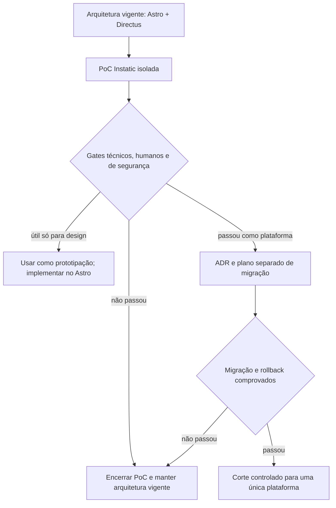
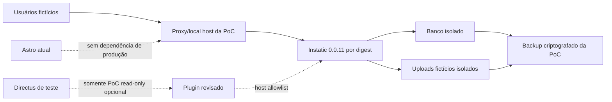

# Plano de avaliação e adoção condicionada do Instatic

**Data:** 21 de julho de 2026  
**Status:** trilha experimental; não autoriza uso em produção  
**Plataforma avaliada:** CoreBunch/Instatic `0.0.11`  
**Objetivo:** descobrir, com uma prova de conceito isolada e mensurável, se o Instatic simplifica a edição visual do Sindquim sem reduzir segurança, continuidade, acessibilidade ou capacidade de migração.

**Documentos relacionados:**

- [Plano mestre validado](2026-07-21-plano-mestre-validado-docker-ux.md)
- [Pesquisa técnica do Instatic](../../research/2026-07-21-instatic-avaliacao.md)
- [Pesquisa Astro × Directus](../../research/2026-07-20-astro-vs-directus-editorial.md)
- [Auditoria visual do fluxo editorial](../../audits/2026-07-21-editorial-ux/README.md)
- [Imagens Docker e atualizações](../../operacao/docker-imagens-e-atualizacoes.md)

## 1. Decisão executiva

O Instatic deve entrar no projeto como **candidato experimental**, e não como uma biblioteca adicionada ao Astro ou ao Directus.

Ele é uma plataforma completa que reúne editor visual, CMS, mídia, autenticação, formulários, plugins, banco e publicação do site. Adotá-lo como produto definitivo significaria, na prática, substituir progressivamente o Astro e o Directus; manter os três como editores permanentes criaria dois CMSs, duas fontes de verdade e duas superfícies de segurança.

A decisão vigente permanece:

- Astro continua responsável pelo site público;
- Directus continua sendo a fonte de verdade e o painel editorial;
- o Instatic pode ser testado apenas em ambiente isolado, com conteúdo fictício e sem dados jurídicos reais;
- nenhuma rota de produção, usuário real, formulário sensível ou domínio público depende do Instatic antes dos gates deste plano;
- um eventual resultado positivo abre uma decisão formal de migração; não produz uma migração automática.

## 2. Por que não tratá-lo como uma dependência comum

| Responsabilidade | Projeto atual | Instatic |
|---|---|---|
| Site público | Astro SSR | publicador HTML/CSS próprio |
| CMS e dados | Directus | CMS e data tables próprios |
| Editor | Directus Data Studio | canvas/editor visual próprio |
| Usuários e papéis | Directus Policies/roles | auth, roles e capabilities próprios |
| Mídia | Directus Files/storage | media workspace/storage próprio |
| Formulários | Astro + Directus | forms nativos |
| Publicação | Astro consulta o CMS | artefatos estáticos + runtime próprio |
| Extensões | extensions/Flows/hooks | plugins isolados em QuickJS-WASM |
| Backup | banco + uploads + configuração | banco + uploads + segredos/configuração |

Portanto, há três caminhos legítimos:

1. **manter Astro + Directus**, opção recomendada agora;
2. **usar Instatic somente para protótipos visuais descartáveis**, sem torná-lo fonte de conteúdo;
3. **avaliar uma substituição futura completa**, após maturidade, segurança e migração serem comprovadas.

O caminho que deve ser evitado é um híbrido permanente em que Notícias vivem no Directus, Benefícios no Instatic, Jurídico parcialmente no Astro e usuários nos dois painéis. Isso duplicaria login, treinamento, backups, permissões, auditoria, SEO, URLs e responsabilidade por incidentes.

## 3. Evidência verificada em 21 de julho de 2026

### 3.1 Estado do produto

- repositório oficial com licença MIT;
- versão pública atual avaliada: `0.0.11`;
- aplicação baseada em Bun, TypeScript, React/Vite no painel e servidor próprio;
- suporte a SQLite e PostgreSQL;
- editor visual, design tokens, mídia, dados estruturados, posts, versões, agenda, formulários e plugins;
- documentação declara que o produto ainda é pré-1.0 e pode alterar APIs e fluxos;
- política de segurança declara que ele ainda não é recomendado, sem revisão cuidadosa do operador, para ambientes multiusuário hostis;
- correções de segurança miram a versão mais recente; versões antigas não são apresentadas como linhas LTS.

Esses pontos tornam a usabilidade promissora, mas impedem classificá-lo hoje como substituto comprovado para uma área com múltiplos editores e dados jurídicos sensíveis.

### 3.2 Teste real da imagem oficial

Foi testada a imagem `ghcr.io/corebunch/instatic:0.0.11`:

- digest do índice: `sha256:4fe8eceb7b4366af9f13c69e924aa0254d43c29bd823818b72760db2877d0359`;
- plataforma publicada: `linux/amd64`;
- host Docker do teste: `linux/arm64`, portanto a execução usou emulação;
- healthcheck HTTP: passou;
- `/` respondeu `302` no primeiro acesso;
- `/admin` respondeu `200`;
- banco SQLite e uploads persistentes iniciaram com volumes separados em `/app/data` e `/app/uploads`.

Também foi encontrada uma diferença operacional relevante:

- o exemplo genérico que monta um volume novo em `/app/storage` falhou com `EACCES` ao criar `/app/storage/data` sob o usuário não-root;
- o desenho do Compose oficial, que monta volumes nas pastas já preparadas `/app/data` e `/app/uploads`, iniciou corretamente;
- a PoC deve usar o segundo desenho ou uma etapa explícita, auditada e não-root de preparação de permissões;
- executar permanentemente como `root` não será aceito apenas para contornar o volume.

### 3.3 Portabilidade e recuperação

O pacote de transferência de site do Instatic leva conteúdo, shell visual, mídia e redirects, mas não substitui um backup completo. Ele não inclui usuários, senhas, sessões, papéis, auditoria, segredos, estado de plugins e todas as configurações operacionais.

Consequência: a estratégia de desastre continua exigindo banco, uploads, configuração protegida, chave `INSTATIC_SECRET_KEY`, manifesto da imagem e ensaio de restauração. Exportar um ZIP do site não atende sozinho ao RPO/RTO do projeto.

## 4. Hipóteses que a PoC precisa responder

### H1 — edição visual realmente reduz esforço

Uma pessoa com baixa familiaridade digital consegue:

- criar uma notícia com capa, texto, fonte e galeria;
- pré-visualizar o resultado no contexto da página;
- corrigir um erro;
- publicar ou agendar;
- identificar inequivocamente o que está em rascunho e o que está público.

### H2 — páginas de conversão ficam fáceis de manter

O responsável consegue atualizar Benefícios e o conteúdo público de Jurídico sem quebrar hierarquia, contraste, responsividade, CTA, SEO ou componentes compartilhados.

### H3 — liberdade visual não compromete o sistema de design

Papéis editoriais comuns não conseguem alterar estrutura global, injetar script, remover avisos obrigatórios, criar contraste inadequado ou publicar componentes não aprovados.

### H4 — governança cobre o cenário real

É possível separar, com testes de negação:

- dono técnico;
- administrador;
- designer visual;
- editor de Notícias;
- responsável por Benefícios;
- responsável pelo conteúdo público Jurídico;
- atendimento jurídico privado.

### H5 — operação Docker é previsível

Atualização, persistência, backup, restauração, arquitetura da CPU, healthcheck, rollback e rotação segura de segredos funcionam sem perda de conteúdo ou usuários.

### H6 — existe saída sem aprisionamento indevido

Conteúdo estruturado, mídia, slugs, redirects e metadados podem ser extraídos e reconstruídos em outra plataforma com custo conhecido. O HTML publicado não será considerado sozinho um modelo de dados suficiente.

## 5. Escopo exato da PoC

### Incluído

1. um site Instatic local, acessível somente na máquina/rede de teste;
2. três páginas: início mínima, Benefícios e Jurídico público;
3. um tipo estruturado de Notícias;
4. dez notícias fictícias com variações de conteúdo;
5. seis benefícios fictícios, incluindo ativo, futuro e expirado;
6. perguntas frequentes e CTAs sem contatos reais;
7. papéis fictícios e contas de teste;
8. SQLite para a primeira rodada e PostgreSQL para o teste de concorrência/restore;
9. backup e restauração em containers/volumes novos;
10. testes de desktop, teclado e viewport móvel;
11. exportação e inventário de tudo que não é exportado;
12. upgrade ensaiado entre versões quando houver uma versão posterior aprovada para teste.

### Excluído

- CPF, nome, telefone, e-mail ou relato jurídico reais;
- anexos de usuários reais;
- credenciais de IA ou serviços externos;
- exposição pública na internet;
- substituição das rotas Astro existentes;
- sincronização bidirecional com o Directus;
- migração de usuários reais;
- uso de `latest` em ambiente compartilhado;
- plugins de terceiros sem revisão de código, manifesto e permissões;
- decisão de produção baseada apenas em demonstração visual.

## 6. Modelo editorial mínimo a provar

### 6.1 Notícias

O post type ou tabela equivalente precisa oferecer:

| Campo | Regra da PoC |
|---|---|
| título | obrigatório; limite e mensagem clara |
| slug | derivado automaticamente; editável só em opção avançada |
| resumo | sugestão/contador; fallback previsível |
| capa | imagem, alt, crédito e recorte controlado |
| corpo | blocos aprovados, sem HTML/script arbitrário |
| categoria | relação controlada |
| galeria | múltiplas imagens ordenáveis, com alt/legenda/crédito |
| fonte | nome e URL validados |
| vídeo | URL validada, sem iframe arbitrário |
| status | rascunho, agendado, publicado e arquivado |
| publicação | data/hora com timezone explícito |
| destaque | reservado a papel autorizado |
| autoria | usuário individual e histórico recuperável |

O caminho principal deve mostrar primeiro apenas título, capa e corpo. Categoria, resumo, fonte, galeria, vídeo, agenda e SEO ficam em seções progressivas. A liberdade de arrastar blocos não pode permitir que o Editor destrua o template da matéria.

### 6.2 Benefícios

Cada benefício deve permanecer dado estruturado:

- título e resumo;
- categoria;
- público/elegibilidade;
- condições e documentos necessários;
- como usar;
- contato/CTA;
- validade;
- status;
- ordem e destaque;
- responsável e data de revisão.

O teste precisa verificar se o canvas visual consome os registros sem transformar cada card em cópia manual. Alterar um token ou componente deve atualizar todos os cards compatíveis.

### 6.3 Jurídico

A PoC cobre somente conteúdo público:

- áreas atendidas;
- limites do serviço;
- passos da triagem;
- prazo de retorno aprovado;
- FAQ;
- privacidade e CTA.

Chamados, CPF, descrição, anexos, filas e respostas permanecem fora do Instatic até existir revisão de segurança independente e aprovação LGPD. Se a plataforma for avaliada futuramente para essa parte, ela receberá threat model e gate próprios.

## 7. Desenho técnico do ambiente experimental

Regras:

- Compose próprio da PoC, fora do Compose de produção;
- hostname/porta interna, como `instatic-poc.local` ou `127.0.0.1:3029`;
- imagem exata por digest;
- `INSTATIC_SECRET_KEY` gerada fora do arquivo versionado;
- usuário não-root;
- volumes separados para banco e uploads;
- nenhuma montagem do repositório ou Docker socket;
- `read_only`, `tmpfs`, `cap_drop`, limites de CPU/memória e rede mínima quando compatíveis;
- egress bloqueado por padrão;
- logs sem segredos/dados pessoais;
- exclusão segura dos dados fictícios ao terminar a avaliação.

### Integração opcional com Directus

Não foi identificada integração nativa com Directus. A arquitetura de plugins do Instatic permite, em tese, declarar acesso de rede e criar uma fonte de dados customizada, mas isso precisa ser provado.

Se testada, a integração deve ser:

- unilateral e somente leitura;
- contra um clone sem dados sensíveis;
- com token técnico de mínimo privilégio e expiração;
- limitada por host allowlist;
- sem gravar de volta no Directus;
- sem espelhar usuários/senhas;
- desligável sem quebrar o site atual;
- tratada como hipótese técnica, não como funcionalidade garantida.

Se esse caminho exigir manter dois modelos, dois editores ou sincronização de conflitos, a integração falha no gate arquitetural.

## 8. Segurança, privacidade e cadeia de suprimentos

### Gates mínimos da PoC

- fixar tag e digest; nunca `latest`;
- gerar SBOM e guardar com o relatório;
- executar scan de imagem, dependências e segredos;
- revisar CVEs transitivas do Bun e da imagem base;
- confirmar assinatura/provenance disponível e política de verificação;
- revisar cookies, CSRF, headers, rate limits, lockout e recuperação de conta;
- testar MFA, step-up e revogação de sessões;
- testar allow/deny de cada capability por papel;
- revisar o isolamento de plugins e negar rede/segredos por padrão;
- testar upload por tipo, tamanho, conteúdo ativo e path traversal;
- testar XSS armazenado, URL `javascript:`, SVG ativo, iframe e rich text malicioso;
- confirmar que auditoria não pode ser alterada por papéis comuns;
- mapear quais dados são criptografados, com qual chave e como a chave é recuperada;
- não aceitar vulnerabilidade crítica/alta sem decisão documentada, mitigação e prazo.

### Gate adicional para produção multiusuário

Pelo aviso oficial de segurança pré-1.0, uma das condições abaixo precisa existir antes de expor o painel a usuários reais:

1. a política oficial deixa de recomendar cautela para ambientes multiusuário hostis e a versão estável atende aos demais testes; ou
2. uma revisão independente de segurança, com escopo de autenticação, autorização, editor, plugins, uploads e publisher, conclui sem achado crítico/alto não tratado.

Para dados jurídicos privados, uma revisão geral não basta: será necessário threat model, DPIA/RIPD quando aplicável, retenção, antimalware, storage privado e teste de incidente específicos.

## 9. UX, acessibilidade e testes humanos

### Tarefas de avaliação

- configurar português do Brasil e revisar microcopy;
- preservar rótulos visíveis, ajuda curta e mensagens junto ao erro;
- limitar o canvas a componentes/blocos aprovados para cada papel;
- diferenciar edição de conteúdo de edição de estrutura/estilo;
- oferecer desfazer, histórico e recuperação compreensíveis;
- validar foco, atalhos, overlays, drag-and-drop e alternativas por teclado;
- testar zoom de 200% e reflow a 320 CSS px;
- testar contraste e estados de foco;
- testar leitor de tela nos fluxos centrais;
- testar queda de rede, sessão expirada, upload falho e conflito de edição;
- confirmar que o HTML público continua semântico e navegável sem JavaScript quando aplicável.

### Sessões humanas

Participantes mínimos:

- três pessoas com pouca familiaridade com CMS;
- uma pessoa responsável por conteúdo;
- uma pessoa que use teclado/leitor de tela ou tenha necessidade de acessibilidade relevante;
- nenhum participante deve ter recebido treinamento detalhado antes da primeira tentativa.

Tarefas:

1. publicar uma notícia simples;
2. adicionar fonte e galeria;
3. corrigir o alt de uma imagem;
4. agendar e cancelar um agendamento;
5. alterar a validade de um benefício;
6. atualizar o CTA público de Jurídico sem acessar chamados;
7. localizar e restaurar uma versão anterior.

Metas para passar:

- pelo menos 90% das tarefas essenciais concluídas sem ajuda;
- notícia simples publicada em até três minutos pela mediana, após o primeiro uso;
- zero publicação acidental de rascunho;
- zero quebra de layout/sistema visual por Editor comum;
- no máximo um erro recuperável por tarefa essencial;
- SUS igual ou superior a 80 ou métrica equivalente previamente definida;
- nenhuma violação crítica/séria no axe e nenhuma barreira manual impeditiva;
- confiança declarada de pelo menos 4/5 para publicar e desfazer.

As metas são critérios de teste, não promessas antecipadas.

## 10. Docker, backup, atualização e rollback da PoC

### Imagem

- criar manifesto com versão, digest, plataforma, commit upstream e data;
- se o servidor alvo for arm64 e ainda não existir imagem oficial arm64, construir de source em CI a partir de commit/tag verificado;
- não construir no servidor;
- comparar a imagem customizada com a receita oficial;
- testar amd64 e arm64 apenas se ambas forem realmente necessárias;
- promover exatamente o mesmo digest de teste para qualquer homologação futura.

### Volumes

- SQLite em volume montado em `/app/data`;
- uploads em volume montado em `/app/uploads`;
- nunca montar volume novo em caminho não preparado sem verificar UID/GID;
- nunca executar `docker compose down -v` fora da destruição explícita da PoC;
- testar criação limpa, restart, recriação do container e disco cheio.

### Backup completo

O conjunto recuperável deve conter:

- dump consistente PostgreSQL ou snapshot seguro do SQLite;
- uploads, fontes, plugins e artefatos persistentes necessários;
- `INSTATIC_SECRET_KEY` em cofre separado e recuperável;
- variáveis/configuração sem segredos no manifesto;
- tag/digest da imagem;
- checksums;
- instrução de restauração;
- inventário de versão e schema.

O site-transfer ZIP será guardado como exportação adicional, não como backup principal.

### Teste de restauração

1. criar notícia, usuário, papel, mídia e alteração de design fictícios;
2. gerar backup consistente;
3. destruir somente os containers e volumes explicitamente nomeados da PoC;
4. criar ambiente vazio;
5. restaurar banco, uploads, chave e digest;
6. validar login, papéis, auditoria, mídia, rotas e conteúdo;
7. comparar contagens e checksums;
8. medir RPO/RTO;
9. registrar resultado e falhas.

### Atualização

- backup e restore recente antes do upgrade;
- ler release notes e diff de migrations;
- atualizar primeiro um clone;
- executar smoke, E2E, RBAC, acessibilidade e conteúdo;
- manter digest anterior disponível;
- reverter imagem apenas quando schema permanecer compatível;
- restaurar dados somente quando a migration exigir e segundo runbook;
- nunca habilitar atualização automática de `latest`.

## 11. Fases e gates

### Fase I0 — enquadramento e isolamento

Tarefas:

- registrar ADR de que Instatic é candidato, não dependência aprovada;
- definir dono, prazo, orçamento e data de encerramento da PoC;
- criar threat model inicial;
- criar Compose isolado e política de rede;
- fixar `0.0.11` pelo digest verificado;
- criar dados e usuários inteiramente fictícios;
- documentar limpeza segura.

Gate: nenhum recurso, dado ou rota de produção depende da PoC.

### Fase I1 — baseline operacional

Tarefas:

- iniciar a imagem no ambiente da equipe;
- resolver volumes sem elevar permanentemente para root;
- confirmar healthcheck, logs e limites;
- executar scan/SBOM;
- testar persistência após recriação;
- medir consumo ocioso e sob publicação;
- confirmar estratégia para a arquitetura real do servidor.

Gate: container reproduzível, não-root, saudável, versionado e restaurável.

### Fase I2 — modelo e experiência editorial

Tarefas:

- criar Notícias, Benefícios e Jurídico público conforme seção 6;
- configurar blocos, tokens e limites por papel;
- implementar validações, estados e agenda;
- testar mídia, galeria e alt;
- criar estados vazio, erro, expirado e indisponível;
- verificar versão/desfazer e conflito.

Gate: requisitos funcionais atendidos sem HTML/estrutura soltos por Editor comum.

### Fase I3 — identidade, autorização e segurança

Tarefas:

- criar matriz de capabilities;
- executar todos os casos allow/deny via UI e API;
- testar convite, MFA, suspensão, revogação e recuperação;
- testar upload, XSS, CSRF, sessão, rate limit e plugins;
- revisar auditoria e segredos;
- registrar achados e aceite formal.

Gate: zero achado crítico/alto não tratado; nenhum papel se autoeleva ou acessa dados fora do escopo.

### Fase I4 — qualidade pública e teste humano

Tarefas:

- executar E2E das três jornadas;
- medir SEO, HTML, Web Vitals e degradação sem JS;
- executar axe e auditoria manual;
- realizar as sessões humanas;
- comparar resultados com Directus configurado, usando as mesmas tarefas e participantes quando possível;
- calcular tempo total de criação, revisão, manutenção e suporte.

Gate: metas da seção 9 e vantagem demonstrável sobre a solução atual configurada.

### Fase I5 — portabilidade, desastre e decisão

Tarefas:

- exportar o site bundle e listar exclusões;
- executar backup/restauração completo;
- extrair dados estruturados e redirects para formato neutro;
- estimar migração de entrada e saída;
- preencher a matriz de decisão;
- emitir decisão `encerrar`, `prototipar` ou `planejar migração`.

Gate: decisão registrada com evidências, custos, riscos, responsável e validade.

## 12. Matriz de decisão final

Cada categoria recebe nota de 0 a 5. Nota 0 em segurança, recuperação ou acessibilidade reprova o candidato, independentemente da média.

| Categoria | Peso | Evidência exigida |
|---|---:|---|
| facilidade editorial | 20% | tarefas humanas, tempo, erros, confiança |
| segurança e RBAC | 20% | testes allow/deny, scan e revisão |
| acessibilidade | 15% | axe + auditoria manual + participante |
| continuidade | 15% | backup/restore, upgrade e rollback |
| aderência funcional | 10% | Notícias, Benefícios, Jurídico público |
| desempenho/SEO | 5% | métricas e HTML público |
| operação Docker | 5% | digest, plataforma, volumes, health |
| portabilidade | 5% | exportação estruturada e saída |
| custo total | 5% | implantação, suporte, migração e treinamento |

Para avançar à análise de migração:

- média ponderada mínima: 4,0/5;
- nenhuma categoria abaixo de 3;
- segurança, continuidade e acessibilidade com pelo menos 4;
- experiência editorial superior ao Directus já simplificado, e não apenas ao painel atual mal configurado;
- aprovação técnica, editorial, privacidade e operação.

## 13. Decisões possíveis ao final

### A. Encerrar a avaliação

Aplicável quando segurança, maturidade, UX, operação ou portabilidade não passam. Remover containers/volumes da PoC, guardar relatório e manter Astro + Directus.

### B. Usar apenas para prototipação visual

Aplicável se o canvas acelerar a descoberta de layout, mas a plataforma não passar como produção. Os protótipos usam conteúdo fictício; o resultado aprovado é reimplementado nos componentes Astro e no modelo Directus. O Instatic não vira fonte de verdade nem dependência de runtime.

### C. Planejar substituição da plataforma

Aplicável somente se todos os gates passarem. Abrir um projeto separado de migração contendo:

- ADR substituindo a decisão Astro + Directus;
- mapa campo a campo e asset a asset;
- migração de URLs, canonical, redirects e SEO;
- migração/recriação segura de usuários, sem copiar senhas quando não suportado;
- ensaio com clone de produção;
- operação paralela temporária somente leitura;
- congelamento editorial curto;
- reconciliação de conteúdo;
- corte por tráfego;
- rollback completo para Astro + Directus durante janela definida;
- desativação de uma das plataformas depois da estabilidade.

Mesmo neste cenário, o Instatic deve ser a plataforma única resultante. Não manter dois CMSs editáveis.

## 14. Cronograma e esforço incremental

Estimativa da avaliação, sem dados reais e com uma pessoa desenvolvedora:

- **2 dias:** I0, ambiente e threat model inicial;
- **2–3 dias:** I1, Docker, plataforma, scan, persistência e baseline;
- **3–5 dias:** I2, modelo editorial e três páginas de prova;
- **2–4 dias:** I3, identidade, RBAC e segurança;
- **2–3 dias:** I4, qualidade e sessões humanas;
- **1–2 dias:** I5, restore, portabilidade e decisão.

Faixa: **2–3 semanas**, dependendo da maturidade encontrada e da disponibilidade de participantes. Essa trilha é opcional e não deve bloquear a contenção P0 do plano mestre.

Uma migração de produção, se aprovada, não está incluída nessa faixa. Ela precisa ser estimada somente após o mapa de dados, os testes de segurança e a estratégia de usuários estarem concluídos; como reserva inicial, acrescentaria várias semanas ao roteiro principal e uma janela própria de hypercare.

## 15. Definition of Done da avaliação

- [ ] Instatic foi tratado como plataforma alternativa, não como addon presumido;
- [ ] imagem, versão, digest e plataforma foram registrados;
- [ ] PoC não contém dado pessoal ou segredo de produção;
- [ ] container executa sem root e volumes persistem;
- [ ] Notícias, Benefícios e Jurídico público foram modelados;
- [ ] papéis e capabilities passaram em casos positivos e negativos;
- [ ] backup completo restaurou usuários, papéis, auditoria, conteúdo e mídia;
- [ ] site-transfer foi testado e suas exclusões foram registradas;
- [ ] segurança, acessibilidade, SEO, desempenho e UX foram medidos;
- [ ] participantes reais compararam Instatic com Directus configurado;
- [ ] custo de entrada, manutenção e saída foi estimado;
- [ ] matriz de decisão foi preenchida;
- [ ] decisão final e responsável foram registrados;
- [ ] a PoC foi eliminada com segurança ou promovida somente para uma migração formal aprovada.

## 16. Fontes primárias

- [Repositório e README do Instatic](https://github.com/CoreBunch/Instatic)
- [Release 0.0.11](https://github.com/CoreBunch/Instatic/releases/tag/v0.0.11)
- [Política de segurança](https://github.com/CoreBunch/Instatic/blob/main/SECURITY.md)
- [Imagem Docker](https://github.com/CoreBunch/Instatic/blob/main/docs/deployment/docker-image.md)
- [Autenticação e controle de acesso](https://github.com/CoreBunch/Instatic/blob/main/docs/features/auth-and-access.md)
- [Transferência de site](https://github.com/CoreBunch/Instatic/blob/main/docs/features/site-transfer.md)

