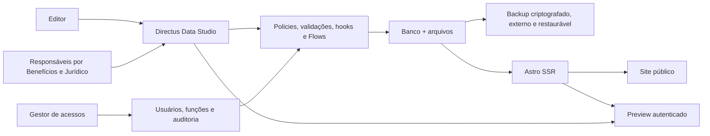
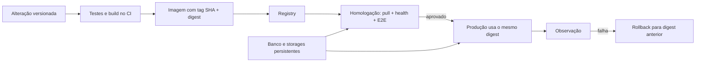

# Plano mestre validado — Sindquim, Astro e Directus

**Data:** 21 de julho de 2026  
**Status:** pronto para execução após o Gate 0 de licenciamento e inventário da produção  
**Substitui:** `2026-07-20-arquitetura-editorial-hibrida-astro-directus.md` como roteiro operacional principal  
**Escopo ampliado em 21 de julho de 2026:** recuperação de desastre, gestão de usuários, página de Benefícios, evolução da página Jurídico e avaliação condicionada do Instatic  
**Evidências relacionadas:**

- [Pesquisa Astro × Directus](../../research/2026-07-20-astro-vs-directus-editorial.md)
- [Pesquisa técnica do Instatic](../../research/2026-07-21-instatic-avaliacao.md)
- [Auditoria visual do fluxo editorial](../../audits/2026-07-21-editorial-ux/README.md)
- [LGPD — campos e finalidades dos formulários](../../lgpd/campos-formularios.md)
- [Guia operacional de imagens Docker e atualizações](../../operacao/docker-imagens-e-atualizacoes.md)
- [Plano de avaliação e adoção condicionada do Instatic](2026-07-21-plano-avaliacao-instatic.md)

## 1. Objetivo

Entregar a plataforma digital do sindicato com quatro resultados integrados:

1. uma pessoa sem treinamento técnico consegue criar, revisar e publicar uma notícia com a simplicidade percebida de postar em uma rede social;
2. um gestor autorizado consegue convidar, revisar, alterar e desativar usuários sem conceder privilégios indevidos;
3. matérias, usuários, configurações e arquivos podem ser recuperados depois de erro humano, falha de atualização ou perda do servidor;
4. as páginas de **Benefícios** e **Jurídico** são claras, bonitas, acessíveis e orientadas a uma próxima ação útil, sem promessas enganosas.

Tudo isso deve ser entregue sem sacrificar segurança, histórico, governança, privacidade ou qualidade editorial.

**Regra permanente:** Astro, Directus e serviços de apoio executam sempre em Docker nos ambientes compartilhados. Produção recebe imagens imutáveis já testadas e publicadas em registry; não compila código diretamente no servidor e não usa tags flutuantes como única referência.

O fluxo mínimo deve permitir:

1. entrar no painel;
2. clicar em **Nova notícia**;
3. preencher título, foto de capa e texto;
4. visualizar antes de publicar;
5. publicar com uma ação inequívoca;
6. receber confirmação e abrir a matéria no site.

O fluxo completo deve acrescentar, sem poluir o caminho principal:

- resumo;
- categoria;
- galeria ordenada;
- legenda, crédito e texto alternativo por imagem;
- nome e URL da fonte;
- link do YouTube;
- agendamento;
- destaque na página inicial;
- histórico e restauração;
- auditoria por usuário.

O escopo ampliado também deve permitir:

- convidar uma pessoa por e-mail para o painel;
- escolher uma função previamente aprovada, sem editar permissões técnicas na mesma tela;
- suspender o acesso imediatamente e preservar o histórico do usuário;
- consultar o estado do último backup e do último ensaio de restauração;
- cadastrar benefícios como cards estruturados, e não como um único bloco de HTML;
- editar a página Jurídico e acompanhar chamados em área restrita;
- medir cliques e conclusões de formulários sem capturar o conteúdo sensível enviado.

## 2. Decisão arquitetural

### 2.1 Decisão principal

O produto deve adotar uma arquitetura híbrida disciplinada:

- **Directus Data Studio:** única interface editorial de Notícias, mídia, permissões, estados, versões, atividade e agenda;
- **Astro:** site público, SEO, preview autenticado e módulos administrativos específicos que não duplicam o CMS;
- **banco:** fonte única de verdade acessada pelo Directus;
- **nenhum segundo editor de Notícias no Astro** depois do corte.



Essa separação segue o padrão observado nas documentações oficiais de Directus, Astro, Strapi, Sanity, Contentful e Payload: o CMS governa autoria e conteúdo; o frontend independente apresenta o conteúdo.

### 2.2 Decisão condicionada sobre a versão do Directus

O projeto atual usa a tag flutuante `directus/directus:11`, que resolveu para **11.17.4** no teste. O Directus informou **12.1.1** como versão disponível.

O teste da 12.1.1 em uma cópia do banco teve resultados mistos:

- migração do banco: passou;
- login administrativo: passou;
- leitura das quatro notícias: passou;
- páginas Astro públicas: passaram;
- scan Trivy: caiu de 78 ocorrências HIGH + 5 CRITICAL na 11.17.4 para 7 HIGH + 0 CRITICAL na 12.1.1;
- `/server/health`: passou a responder 403; `/server/ping` respondeu 200 e deve ser usado no healthcheck básico;
- `directus-schema.mjs`, `setup-configuracoes.mjs` e `setup-juridico.mjs`: falharam ao criar regras de permissão com `RESOURCE_RESTRICTED/custom_permission_rules_enabled`;
- o dashboard Astro continuou retornando 404 para o Editor, pois essa é uma falha da aplicação, não da versão do CMS.

O Directus 12 introduziu enforcement de licença para **custom permission rules**. Essas regras são essenciais para esconder rascunhos, limitar campos, fixar presets e restringir arquivos. Portanto, a atualização para 12 não pode ser tratada como simples troca de tag.

**Gate obrigatório antes da implementação:** confirmar por escrito qual licença/entitlement se aplica ao sindicato e se custom permission rules estarão habilitadas. A documentação oficial da versão 12 informa enforcement imediato em instalações novas, carência de 30 dias em upgrades e bloqueios após a carência quando o uso excede o Core.

Ordem de preferência:

1. obter licença ou grant que preserve custom permission rules e usar Directus 12.1.1 ou patch superior validado;
2. se isso não for viável, comparar formalmente o custo de um Directus compatível com o custo de migração para outra plataforma;
3. manter 11.17.4 apenas como contenção temporária, atrás de controles de rede e com plano de saída definido;
4. não remover filtros/validações para “caber” no Core, pois isso recriaria a exposição de rascunhos e arquivos encontrada no teste.

Referências oficiais:

- [Directus 12 — breaking changes e license enforcement](https://github.com/directus/docs/blob/main/content/releases/3.breaking-changes/3.version-12.md)
- [Docker Guide do Directus](https://docs.directus.io/self-hosted/docker-guide)
- [CMS no Astro](https://docs.astro.build/en/guides/cms/)
- [Directus com Astro](https://docs.astro.build/en/guides/cms/directus/)

### 2.3 Instatic: candidato experimental, não adição imediata

O [CoreBunch/Instatic](https://github.com/CoreBunch/Instatic) foi avaliado como alternativa por sua proposta de edição visual integrada. Ele não é uma biblioteca pequena para conectar ao Astro ou ao Directus: inclui CMS, canvas visual, dados, mídia, autenticação, formulários, plugins e publicador próprio. Uma adoção definitiva sobreporia e substituiria responsabilidades centrais dos dois produtos atuais.

A versão avaliada, `0.0.11`, é pré-1.0. A própria [política de segurança](https://github.com/CoreBunch/Instatic/blob/main/SECURITY.md) informa que o produto ainda não é recomendado para ambientes multiusuário hostis sem revisão cuidadosa do operador. A imagem oficial também está publicada apenas para `linux/amd64`; no ambiente Docker `arm64` deste estudo ela iniciou por emulação.

Assim, a decisão principal desta seção não muda. O Instatic entra por uma **trilha de PoC isolada e opcional**, definida no [plano específico](2026-07-21-plano-avaliacao-instatic.md), com três saídas permitidas:

1. reprovar e manter Astro + Directus;
2. usar somente para protótipos visuais descartáveis e reimplementar no Astro;
3. se todos os gates passarem, abrir um projeto separado para substituir a plataforma, com migração e rollback comprovados.

Não manter dois CMSs editáveis em produção. Notícias, Benefícios, Jurídico ou usuários não podem ficar divididos permanentemente entre Directus e Instatic. O piloto não recebe dados reais, anexos jurídicos, usuários de produção, credenciais externas ou tráfego público.

O teste Docker da imagem `ghcr.io/corebunch/instatic:0.0.11` confirmou `/health` saudável e `/admin` com HTTP 200 usando volumes nos caminhos oficiais do Compose (`/app/data` e `/app/uploads`). O exemplo genérico com um volume novo em `/app/storage` falhou por permissão sob o usuário não-root. Qualquer piloto deve preservar o runtime não-root, fixar o digest e validar o layout dos volumes, em vez de contornar o problema executando o serviço como root.

## 3. O que foi realmente validado

### 3.1 Ambiente instalado

- Docker CLI 29.6.2;
- Docker Engine 29.5.2, Linux arm64;
- Docker Compose 5.3.1;
- Docker Buildx 0.35.0;
- Colima 0.10.3 com Virtualization.Framework, 4 CPUs e 8 GB de RAM;
- `hello-world`: passou;
- stack isolada Directus + Astro: subiu e respondeu em 8055/4321;
- clone migrado Directus 12.1.1 + Astro: subiu e respondeu em 8056/4322.

### 3.2 Resultados técnicos

| Teste | Resultado | Consequência |
|---|---|---|
| `docker compose config --quiet` | passou | YAML é válido |
| build exato do repositório | falhou | bloqueia entrega reproduzível |
| build com duas correções temporárias na cópia | passou | arquitetura geral é executável |
| Vitest completo | 17/17 passou | testes existentes estão verdes |
| Vitest local | 11/11 passou | testes locais estão verdes |
| `bash -n scripts/*.sh` | passou | sintaxe shell válida |
| `node --check` nos `.mjs` | passou | sintaxe JS válida |
| dry-run de backup | passou | sequência é visível e não toca no LXC |
| dry-run de deploy | passou | confirmou backup antes da substituição |
| reinício dos containers | passou | quatro posts preservados |
| `PRAGMA integrity_check` | `ok` | SQLite de teste íntegro |
| smoke de 11 rotas | 11 responderam 200 | superfície principal inicia |
| login Astro como Editor | 302 | autenticação funciona |
| dashboard Astro como Editor | 404 | falha funcional crítica |
| lista Astro de Notícias como Editor | 200 | rota específica funciona |
| scan da imagem Astro | 3 HIGH + 1 CRITICAL | dependências da imagem precisam ser atualizadas |
| scan Directus 11.17.4 | 78 HIGH + 5 CRITICAL, 54 IDs únicos | versão atual não é aceitável como estado final |
| scan Directus 12.1.1 | 7 HIGH + 0 CRITICAL, 4 IDs únicos | candidato tecnicamente melhor, condicionado à licença |

### 3.3 Falhas exatas do build

1. `site/src/pages/api/admin/noticias/salvar.ts` importa `../../../../../lib/auth`, um nível acima do correto.
2. Depois da correção temporária, `site/src/pages/noticias/[slug].astro` importa `isomorphic-dompurify`, mas o pacote não existe no `package.json` nem no lockfile.
3. Não existe `.dockerignore`; quando `node_modules` existe no host, o contexto cresceu de aproximadamente 275 KB para 272 MB e `COPY . .` pode sobrepor dependências instaladas dentro da imagem.
4. `astro check` não está configurado porque faltam `@astrojs/check` e TypeScript como dependências de desenvolvimento.

### 3.4 Falhas de segurança confirmadas por execução

- a Policy pública lê `posts` sem filtro; um rascunho criado no teste foi lido anonimamente com HTTP 200;
- a Policy pública lê `documentos` e `directus_files` com campos `*` e sem filtro;
- o perfil Editor tem 68 regras em 18 coleções;
- o Editor possui `delete` em 16 coleções, inclusive Notícias, Categorias, Configurações, Documentos, mensagens e conteúdo Jurídico;
- em `posts`, o Editor tem todos os campos e nenhuma validação/preset;
- o teste real permitiu ao Editor criar um rascunho, alterar `fixado_banner`, listar arquivos e excluir a notícia;
- `directus-schema.mjs` ignora permissões existentes com `SKIP`, portanto não corrige uma regra insegura já criada;
- o painel Astro aceita qualquer usuário Directus autenticável e só descobre a falta de permissão quando a página consulta uma coleção;
- o dashboard Astro traduz uma falha de autorização em 404, mascarando o problema;
- a imagem Astro contém CVE crítica em `tar` 7.5.15 e vulnerabilidades HIGH em `undici`, `brace-expansion` e `tar`;
- o Astro 7.0.6 possui um advisory moderado de reflected XSS e já tem atualização 7.1.3 disponível;
- a imagem atual não define security headers no Astro;
- os serviços publicam 8055 e 4321 em `0.0.0.0` no Compose base.

### 3.5 Falhas de UX confirmadas

- login Directus em inglês e marca padrão;
- Editor vê mais de 16 coleções e começa em Avisos;
- lista de Notícias usa tabela técnica, não cartões editoriais;
- formulário abre cerca de 330 px rolado para baixo;
- rótulos ficam quase invisíveis por conflito do custom CSS;
- slug técnico é obrigatório e exposto;
- botão de salvar é apenas um ícone;
- celular abre no meio do WYSIWYG;
- não há preset/layout/Flow de Notícias;
- painel Astro usa jargão, menu fixo e duplica o editor;
- painel Astro não possui galeria, fonte, vídeo, agenda ou preview.

### 3.6 Falhas de conteúdo e produto

- a home contém mojibake em dezenas de textos (`matéria`, `notícias`, `Informação`);
- a imagem de capa da matéria usa `alt=""`;
- o seed contém telefone, e-mail e endereço fictícios;
- a rota `/convencoes`, navegação, sitemap, coleção `documentos`, tipos, consultas e seed continuam ativos, contrariando a decisão do produto;
- a base de produção não está no repositório, logo seu conteúdo real ainda precisa ser inventariado antes de qualquer remoção.
- `/beneficios` é atendida pelo template genérico `[slug].astro`, com apenas título e um bloco WYSIWYG de `paginas`; não existe modelo estruturado de benefícios, filtros, CTA administrável ou medição de conversão;
- `/juridico` já possui hero, cards de direitos, plantões, FAQ, formulário com anexo e painel de chamados; a base deve ser preservada e evoluída para reduzir fricção, melhorar confiança e proteger dados pessoais;
- o formulário jurídico atual exige CPF e anexo logo no primeiro contato; essa necessidade deve ser validada pelo responsável jurídico e de privacidade, pois a triagem inicial pode funcionar com menos dados;
- a aba Usuários de `/admin/settings` apenas lista contas e alterna `active`/`suspended`; não convida usuários, não atribui funções aprovadas, não revoga sessões nem mostra MFA/último acesso;
- `scripts/backup-lxc200-data.sh` compacta `.env`, banco, uploads e extensions e mantém dez arquivos no mesmo ambiente operacional, mas não cria checksum persistido, cópia fora do host, imutabilidade, alerta ou comando de restauração testado.

## 4. Escopo funcional final

### 4.1 Coleção `posts`

| Campo | Tipo | Editor vê? | Regra |
|---|---|---:|---|
| `id` | UUID ou inteiro existente | não | somente sistema |
| `status` | escolha | como estado visual | `draft`, `scheduled`, `published`, `archived` |
| `titulo` | string | sim | obrigatório; 8–140 caracteres |
| `slug` | string | não | gerado no servidor, único e estável após publicar |
| `resumo` | texto curto | em Mais opções | gerado do conteúdo se vazio; limite editorial |
| `conteudo` | rich text | sim | obrigatório para publicar; HTML permitido por allowlist |
| `imagem_capa` | arquivo | sim | exigida para publicar; opcional no rascunho |
| `imagem_capa_alt` | string | sim, junto da capa | obrigatório quando a imagem comunica informação |
| `categoria` | M2O | em Mais opções | preset `Geral` |
| `galeria` | O2M via junção | em Mais opções | 0–20 imagens ordenadas |
| `fonte_nome` | string | condicional | aparece se “Tem fonte” estiver ativo |
| `fonte_url` | URL | condicional | HTTPS; domínio visível no site |
| `youtube_url` | URL | em Mais opções | apenas formatos aceitos; ID normalizado |
| `publicar_em` | datetime | condicional | obrigatório para `scheduled`; futuro |
| `publicado_em` | datetime | somente leitura | gravado pelo servidor |
| `fixado_banner` | boolean | não para Editor | apenas Editor-chefe/Admin; máximo de um |
| `autor` | usuário | somente leitura | preset `$CURRENT_USER` |
| `date_created` | sistema | não no formulário | auditoria |
| `date_updated` | sistema | não no formulário | auditoria |

### 4.2 Coleção de junção `posts_galeria`

| Campo | Regra |
|---|---|
| `post_id` | relacionamento com a matéria |
| `arquivo_id` | somente imagem permitida |
| `ordem` | inteiro mantido por drag-and-drop |
| `legenda` | opcional, limite definido |
| `credito` | opcional, mas recomendado |
| `texto_alt` | exigido quando a imagem não for decorativa |

Invariantes:

- no máximo 20 itens por matéria;
- nenhuma imagem duplicada na mesma galeria;
- arquivo deve pertencer à pasta editorial pública apropriada;
- publicação falha se faltar alt/decisão decorativa;
- exclusão da relação não apaga automaticamente o arquivo compartilhado.

### 4.3 Categorias iniciais

Manter poucas opções e permitir ajuste pelo responsável editorial:

- Geral;
- Sindicato;
- Trabalho e direitos;
- Saúde e segurança;
- Benefícios;
- Mobilização;
- Formação.

O Editor comum seleciona categorias existentes, mas não cria, renomeia ou exclui categorias durante a escrita.

### 4.4 Conteúdo a remover

Remover do produto, após exportação e validação da base ativa:

- coleção `documentos`;
- rota `/convencoes`;
- item “Convenções” da navegação;
- entrada correspondente no sitemap;
- tipos `Documento` e agregações relacionadas;
- `getDocumentos` e consultas associadas;
- tipos `convencao`, `acordo`, `ata`, `edital` e `outro` usados apenas nessa coleção;
- seeds de documentos/convenções/acordos/editais;
- permissões públicas e editoriais da coleção;
- README e documentação que apresentem esse módulo como funcionalidade do site.

Não confundir esse módulo com menções legítimas a “documentos pessoais” dentro da orientação jurídica. Textos editoriais que mencionam acordos/convenções em outro contexto devem passar por revisão de conteúdo, não por substituição automática cega.

Para URLs já indexadas:

- se nunca foram publicadas, remover a rota;
- se já receberam tráfego, escolher conscientemente entre 301 para uma página realmente equivalente ou 410 Gone;
- nunca redirecionar todos os arquivos antigos para uma página sem relação apenas para esconder 404.

### 4.5 Benefícios: modelo de conteúdo e página de conversão

O estado atual — um item em `paginas` renderizado por `[slug].astro` — não é suficiente. Benefícios precisa de conteúdo estruturado no Directus e uma rota Astro dedicada em `/beneficios`.

Coleções propostas:

#### Singleton `pagina_beneficios`

| Campo | Finalidade |
|---|---|
| `hero_rotulo`, `hero_titulo`, `hero_resumo` | proposta de valor clara acima da dobra |
| `hero_imagem` | imagem real aprovada, com recorte responsivo |
| `hero_imagem_alt` | acessibilidade ou marcação explícita de decorativa |
| `cta_primario_texto`, `cta_primario_href` | ação principal, normalmente filiação ou atendimento |
| `cta_secundario_texto`, `cta_secundario_href` | ação alternativa, normalmente ver benefícios |
| `como_funciona_titulo`, `como_funciona_resumo` | introdução do passo a passo |
| `prova_titulo`, `prova_resumo` | confiança baseada apenas em dados reais aprovados |
| `faq_titulo` | título do bloco de dúvidas |
| `cta_final_titulo`, `cta_final_resumo`, `cta_final_*` | chamada final contextual |
| `seo_titulo`, `seo_descricao`, `og_imagem` | SEO e compartilhamento administráveis |

#### Coleção `beneficios`

| Campo | Regra editorial |
|---|---|
| `status`, `ordem`, `destaque` | rascunho/publicado, ordenação e destaque |
| `titulo`, `slug` | título simples e slug gerado |
| `categoria` | relação com `beneficios_categorias` |
| `resumo` | benefício em uma frase, sem jargão |
| `descricao` | detalhes e condições em rich text sanitizado |
| `imagem` ou `icone` | ativo visual real/curado; não obrigatório para publicar |
| `imagem_alt` | obrigatório quando informativo |
| `quem_pode_usar` | elegibilidade em linguagem clara |
| `como_usar` | sequência prática de acesso |
| `o_que_levar` | somente se realmente necessário; não recria o módulo público Documentos |
| `contato_texto`, `contato_href` | CTA individual validado |
| `validade_inicio`, `validade_fim` | evita divulgar condição vencida |
| `aviso` | restrição, disponibilidade ou condição importante |
| `date_updated` | exibido como “informações atualizadas em” quando útil |

Coleções auxiliares: `beneficios_categorias`, `beneficios_passos` e `beneficios_faq`. A primeira entrega pode usar passos e FAQ globais; não criar complexidade se houver poucos itens reais.

Estrutura pública recomendada:

1. **Hero:** “Vantagens práticas para quem é associado”, com CTA primário claro;
2. **atalhos por necessidade:** saúde, formação, lazer, serviços ou as categorias reais aprovadas;
3. **cards de benefícios:** resumo, elegibilidade e CTA; busca/filtro só se a quantidade justificar;
4. **como funciona:** descobrir, confirmar elegibilidade e solicitar;
5. **confiança:** números, depoimentos ou parceiros apenas quando verificáveis e autorizados;
6. **FAQ:** custo, dependentes, validade, atendimento e atualização;
7. **CTA final:** filiação ou conversa com o sindicato, conforme o visitante.

Regras de conversão e confiança:

- um CTA primário por seção; não competir com cinco botões de igual peso;
- deixar claro quando um benefício é exclusivo para associado, tem limite geográfico ou depende de disponibilidade;
- nunca publicar percentual de desconto, parceiro, prazo ou resultado sem fonte e data de validade;
- não misturar “benefícios” com o módulo removido de convenções, acordos, editais ou biblioteca de documentos;
- medir `beneficio_visualizado`, filtro utilizado, clique no CTA, início e conclusão de filiação/contato, sem enviar texto livre nem identificadores pessoais à ferramenta de analytics;
- oferecer navegação e CTA úteis mesmo com JavaScript desativado;
- perseguir WCAG 2.2 AA, foco visível, contraste, alvos de toque e carregamento rápido em celular.

### 4.6 Jurídico: evolução orientada à confiança e à conversão

Não criar uma segunda implementação. A rota, os helpers e as coleções `pagina_juridico`, `juridico_direitos`, `juridico_plantoes`, `juridico_faq`, `juridico_campos_formulario` e `chamados_juridicos` existentes são a base oficial.

Evoluções do modelo:

- ampliar `pagina_juridico` com links reais dos CTAs, imagem/alt, bloco “como funciona”, critérios de atendimento, aviso de urgência/prazos, confiança, privacidade, SEO e CTA final;
- manter direitos, plantões e FAQ como itens ordenáveis e publicáveis;
- versionar os campos ativos do formulário e sua finalidade, obrigatoriedade, retenção e visibilidade por papel;
- registrar em cada chamado status, responsável, timestamps, origem e histórico, sem expor conteúdo no site público;
- deixar CPF e anexo condicionais ou posteriores à triagem, salvo decisão documentada do Jurídico/privacidade que prove a necessidade no primeiro contato;
- separar anexos jurídicos em armazenamento privado, sem URL pública persistente.

Estrutura pública recomendada:

1. **Hero acolhedor:** problema reconhecível, escopo real e CTA “Solicitar orientação”;
2. **em que podemos ajudar:** cards por situação, evitando juridiquês;
3. **como funciona:** envio inicial, triagem e retorno, com prazo real aprovado;
4. **quem pode usar:** critérios claros e alternativa para quem não se enquadra;
5. **confiança:** equipe/qualificações, volume de atendimentos ou depoimentos somente com aprovação e consentimento;
6. **plantões e canais:** local, horário, telefone/WhatsApp e acessibilidade;
7. **FAQ:** documentos, prazo, custo, sigilo, urgência e próximos passos;
8. **triagem segura:** formulário curto com explicação de finalidade antes do envio;
9. **CTA final:** repetir a ação principal sem prometer resultado jurídico.

Regras de conversão, ética e LGPD:

- conversão significa encaminhar a pessoa ao atendimento correto, não pressioná-la a fornecer o máximo de dados;
- não prometer ganho de causa, prazo processual, indenização ou resultado;
- informar que o formulário não substitui atendimento emergencial nem interrompe prazo legal, com texto validado pelo Jurídico;
- mostrar prazo de resposta somente quando a operação conseguir cumpri-lo;
- aplicar minimização, finalidade, transparência, segurança e retenção definida aos dados;
- limitar chamados e anexos ao papel Jurídico e administradores estritamente necessários; editores e Social não acessam;
- aplicar rate limit, honeypot e, se necessário após medição, desafio antiabuso acessível;
- validar extensão, MIME, tamanho e conteúdo do upload; incluir varredura antimalware antes de disponibilizar anexo;
- nunca enviar CPF, descrição, assunto, arquivo, e-mail ou telefone a analytics, logs de aplicação ou URLs;
- disponibilizar Política de Privacidade aprovada antes do lançamento e registrar a versão do aviso apresentada no envio;
- definir prazo de retenção, rotina de eliminação e procedimento de atendimento ao titular com aprovação jurídica/privacidade.

Esta especificação é requisito de produto e segurança, não parecer jurídico. A base legal, os textos e os prazos de retenção precisam de validação do responsável jurídico e de proteção de dados antes do corte.

## 5. Papéis e Policies-alvo

### 5.1 Matriz de acesso

| Capacidade | Público | Editor | Editor-chefe | Benefícios | Jurídico | Social | Gestor de acessos | Admin técnico |
|---|---:|---:|---:|---:|---:|---:|---:|---:|
| Ler notícia publicada | sim | sim | sim | sim | sim | sim | sim | sim |
| Ler rascunho próprio | não | sim | sim | não | não | não | não | sim |
| Criar/editar notícia | não | própria/permitida | sim | não | não | não | não | sim |
| Publicar/agendar notícia | não | conforme regra editorial | sim | não | não | não | não | sim |
| Excluir notícia | não | não | não por padrão | não | não | não | não | excepcional |
| Arquivar notícia | não | própria/permitida | sim | não | não | não | não | sim |
| Fixar banner/categorias | não | não | sim | não | não | não | não | sim |
| Editar página/itens de Benefícios | não | não | opcional | sim | não | não | não | sim |
| Editar conteúdo público Jurídico | não | não | não | não | sim | não | não | sim |
| Ler/atender chamados jurídicos | não | não | não | não | sim | não | não | excepcional e auditado |
| Enviar mídia | não | pasta Editorial | pasta Editorial | pasta Benefícios | pasta Jurídico aprovada | pasta Social | não | sim |
| Convidar/desativar usuário comum | não | não | não | não | não | não | sim | sim |
| Conceder Admin/Gestor de acessos | não | não | não | não | não | não | não | sim, com dupla revisão |
| Editar Policies/schema/segredos | não | não | não | não | não | não | não | sim |

### 5.2 Regras públicas

- `posts.read`: somente `status=published` e `publicado_em <= $NOW`;
- campos públicos explícitos, nunca `*`;
- categorias: apenas campos necessários ao frontend;
- arquivos: somente pastas públicas e apenas metadados/asset necessários;
- nenhum create/update/delete público em conteúdo;
- newsletter e contato, se mantidos, usam endpoints próprios com rate limit, validação, honeypot/CAPTCHA conforme risco e campos mínimos;
- Directus não deve depender de “segredo no frontend” para proteção.

### 5.3 Arquivos

Estrutura sugerida:

```text
Editorial/
├── Capas/
├── Galerias/
└── Rascunhos-privados/

Social/
└── Publicações/

Sistema/
└── Logos-e-configuração/

Jurídico-privado/
└── Anexos-de-chamados/

Benefícios/
└── Imagens-públicas/
```

- Editor acessa somente `Editorial`;
- Social acessa somente `Social`;
- arquivos de rascunho não têm leitura anônima;
- ao publicar, um hook move/confirma o arquivo em pasta pública ou grava metadado explícito de publicação;
- upload aceita apenas MIME e extensões aprovados, tamanho máximo e dimensões razoáveis;
- SVG enviado por usuário é bloqueado ou sanitizado;
- EXIF sensível é removido conforme política;
- arquivos órfãos recebem relatório e limpeza aprovada, nunca exclusão silenciosa.

### 5.4 Painel de cadastro e ciclo de vida de usuários

O Directus continua sendo a fonte de identidade, Roles, Policies, status e Activity Log. O painel Astro pode oferecer uma experiência simplificada de **Gestão de acessos**, mas deve chamar as APIs do Directus com o token do gestor e nunca manter uma segunda tabela de usuários.

Estado existente que será aproveitado:

- `/admin/settings` já lista `directus_users`, função e status;
- já é possível suspender/reativar outra conta;
- a operação atual exige `admin_access` e impede que o administrador suspenda a própria conta.

Lacunas obrigatórias da nova tela:

- botão **Convidar usuário** com nome, e-mail e função aprovada;
- envio de convite de uso único, com validade, em vez de senha criada pelo gestor;
- reenvio/cancelamento de convite;
- busca e filtros por função e status;
- detalhe com função, Policies efetivas, status, MFA, último acesso e data de convite;
- alteração apenas entre funções permitidas ao operador;
- suspender, reativar e revogar sessões/tokens ativos;
- recuperação de senha por link; ninguém no painel visualiza ou escolhe a senha de outra pessoa;
- histórico legível: quem convidou, alterou função, suspendeu ou reativou e quando;
- estados de carregamento, sucesso e erro claros, com confirmação reforçada para perda de acesso;
- boa operação em celular e por teclado.

Guardrails:

- cadastro é somente por convite; não existe autoinscrição pública para acesso administrativo;
- contas são individuais; e-mails ou senhas compartilhados são proibidos;
- Gestor de acessos pode administrar Editor, Editor-chefe, Benefícios, Jurídico e Social apenas dentro da matriz aprovada;
- somente Admin técnico pode conceder ou remover Admin técnico/Gestor de acessos, sempre com segunda revisão registrada;
- nenhum usuário pode aumentar a própria função, desativar a própria conta ou remover o último Admin técnico ativo;
- o painel mostra o resultado de Policies efetivas, mas não oferece um construtor livre de permissões ao gestor comum;
- suspensão revoga sessões e tokens; o histórico e a autoria do conteúdo permanecem;
- arquivar é preferível a excluir conta; exclusão física exige processo excepcional documentado;
- MFA é obrigatório para Admin técnico, Gestor de acessos, Editor-chefe e Jurídico; recomendado para todos;
- mudanças privilegiadas exigem reautenticação recente e geram alerta ao responsável técnico;
- auditoria de `directus_activity` fica restrita e com retenção definida, porque contém usuário, IP e user-agent.

Ciclo de vida operacional:

1. **entrada:** pedido aprovado → convite → MFA → primeiro acesso → confirmação do menor privilégio;
2. **mudança:** função revisada quando a responsabilidade muda, sem acumular acesso antigo;
3. **revisão:** recertificação trimestral de contas ativas, funções privilegiadas, convites pendentes e tokens;
4. **saída:** suspensão e revogação de sessão no mesmo dia; transferência de itens pendentes sem alterar a autoria histórica;
5. **incidente:** suspensão emergencial, export do log, rotação de credenciais afetadas e revisão das alterações do usuário.

Testes de aceitação:

- Gestor convida um Editor, que define a própria senha e entra somente em Notícias;
- Gestor não consegue criar Admin, mudar a própria função ou tocar em Policies;
- Editor, Benefícios, Jurídico e Social não conseguem listar usuários;
- usuário suspenso perde a sessão já aberta e não renova token;
- não é possível suspender/excluir o último Admin técnico;
- cada operação aparece na auditoria com ator, alvo, horário e resultado;
- convite expirado ou reutilizado falha sem revelar existência indevida de contas;
- fluxo completo funciona com teclado, leitor de tela e viewport estreito.

## 6. UX editorial-alvo

### 6.1 Arquitetura da informação

Ao entrar, o Editor vê:

```text
Notícias
├── Todas
├── Rascunhos
├── Agendadas
├── Publicadas
└── Nova notícia

Arquivos
└── Imagens editoriais
```

Não vê Configurações, Jurídico, Documentos, Newsletter, mensagens, páginas institucionais ou coleções de Social Media sem necessidade.

### 6.2 Formulário principal

Primeira dobra:

1. **Título da notícia**;
2. **Foto de capa**, com arrastar/soltar, preview, trocar e remover;
3. **Texto da notícia**, com toolbar curta: parágrafo, subtítulos, negrito, itálico, lista, link, citação e desfazer/refazer.

Seção recolhida **Mais opções**:

- categoria;
- resumo;
- galeria;
- fonte;
- YouTube;
- agendamento;
- texto alternativo/metadados necessários.

Campos escondidos do Editor:

- slug;
- autor técnico;
- datas de sistema;
- identificadores;
- destaque de banner, salvo papel autorizado.

### 6.3 Ações

Ações sempre textuais e próximas:

- **Salvar rascunho**;
- **Ver antes**;
- **Publicar agora**;
- **Agendar publicação** quando a opção estiver ativa;
- **Arquivar** em menu secundário, com confirmação.

Regras:

- nova matéria sempre começa como rascunho;
- salvar rascunho aceita conteúdo incompleto;
- publicar executa validação completa no servidor;
- fechar com alterações não salvas mostra aviso;
- alteração em matéria publicada cria rascunho/revisão, não modifica a versão pública silenciosamente;
- sucesso informa o que aconteceu e oferece **Abrir notícia** e **Criar outra**;
- erros ficam ao lado do campo e também em resumo focável no topo;
- nenhum erro de autorização vira 404.

### 6.4 Lista de Notícias

Preset padrão em cartões:

- miniatura da capa;
- título;
- chip de status em linguagem natural;
- data de publicação/agendamento;
- autor;
- ação principal **Editar**.

Filtros salvos:

- Rascunhos;
- Agendadas;
- Publicadas;
- Arquivadas;
- Minhas notícias.

Busca deve priorizar título e permitir reconhecer o item sem expor slug/ID.

### 6.5 Tema, marca e idioma

- `project_name`: nome aprovado do sindicato;
- idioma padrão `pt-BR` no setting persistido, não apenas variável de ambiente;
- textos públicos e instruções em linguagem simples;
- remover o custom CSS atual baseado em seletores globais;
- usar temas/tokens nativos do Directus;
- aplicar marca apenas depois de o tema claro e escuro passarem nos testes;
- contraste mínimo WCAG AA;
- foco visível;
- não usar jargão como “Headless”, “API invisível” ou “painel premium” para o Editor.

### 6.6 Extensão: somente com evidência

Primeiro configurar campos, grupos, conditions, presets, bookmarks, layouts, roles e tema nativos. Depois executar o teste humano.

Criar extensão Directus mínima apenas se o teste mostrar um obstáculo não resolvível, por exemplo:

- galeria inline ainda complexa;
- ações nativas de publicação continuam ambíguas;
- confirmação contextual de alteração publicada é insuficiente;
- upload móvel exige passos demais.

A extensão não deve reimplementar autenticação, permissões, revisions, arquivos ou CRUD completo.

## 7. Regras de servidor e automações

### 7.1 Hooks obrigatórios

- gerar slug no create;
- resolver colisões de slug;
- impedir alteração do slug após primeira publicação, salvo Admin;
- gerar resumo quando vazio;
- normalizar e validar YouTube;
- validar URL de fonte;
- validar galeria e limite de 20;
- exigir capa/conteúdo/alt no publish;
- preencher autor pelo usuário autenticado;
- gravar `publicado_em` na primeira publicação;
- garantir no máximo um `fixado_banner` publicado;
- impedir que Editor altere campos reservados, mesmo por chamada direta à API;
- sanitizar ou rejeitar HTML fora da allowlist.

### 7.2 Flows

- publicação agendada em intervalo curto e idempotente;
- retentativa segura e registro de falha;
- invalidação de cache/webhook ao publicar, arquivar ou atualizar;
- alerta operacional se uma publicação agendada falhar;
- relatório de arquivos órfãos, sem exclusão automática inicial;
- opcional: notificação editorial de publicação bem-sucedida.

Agendamento não é apenas um campo de data: requer status, relógio consistente, Flow, idempotência e teste de atraso/retentativa.

### 7.3 Sanitização e preview

- `set:html` do Astro só recebe HTML sanitizado;
- a dependência de sanitização deve existir no manifest/lock e rodar no ambiente correto;
- usar allowlist de tags/atributos e bloquear scripts, handlers, iframes arbitrários e URLs perigosas;
- YouTube é renderizado por componente próprio a partir de ID validado;
- preview usa URL temporária/autenticada, `noindex,nofollow` e nunca libera rascunho publicamente;
- não colocar token estático em query string;
- manter atribuição do usuário real no Activity Log.

Referência: [o Astro não escapa conteúdo fornecido a `set:html`](https://docs.astro.build/en/reference/directives-reference/#sethtml).

## 8. Backup, restauração e continuidade

O backup atual é um ponto de partida, não uma solução de recuperação: gera um `.tar.gz` com parte dos volumes e mantém dez cópias, mas ainda pode ser perdido junto com o host e não prova que o sistema volta a funcionar. A solução-alvo segue **3-2-1-1-0**: pelo menos três cópias, em dois meios, uma fora do local, uma imutável/offline e zero erros nos testes de integridade.

### 8.1 O que precisa ser recuperável

| Ativo | O que contém | Método mínimo |
|---|---|---|
| Banco Directus | matérias, usuários, status, Roles, Policies, settings, Flows, revisões, Activity Log, chamados e todo conteúdo | cópia consistente nativa do banco |
| Uploads públicos | capas, galerias, logos e imagens de Benefícios | snapshot/sincronização no mesmo ponto de recuperação do banco |
| Uploads privados | anexos Jurídico e eventuais rascunhos privados | backup separado, criptografado e com acesso mais restrito |
| Extensions | hooks, endpoints, interfaces e bundles instalados | volume + código-fonte/digest da release |
| Configuração | `.env`, Compose, proxy, SMTP, storage e variáveis | cofre de segredos + versão criptografada de recuperação |
| Schema/config do Directus | coleções, campos, relações e metadados | snapshot declarativo versionado por release |
| Aplicação Astro e scripts | frontend, migrations, runbooks e testes | repositório Git remoto e artefato/imagem por digest |
| Evidências operacionais | manifesto, checksums, logs de backup/restore, versão | manifesto assinado ou protegido contra alteração |

O `schema snapshot` não substitui backup: ele reconstrói estrutura/configuração, mas não devolve itens, usuários, arquivos ou histórico. O banco continua obrigatório.

### 8.2 Consistência e estratégia por banco

O banco real precisa ser confirmado na Fase 0.

- **Enquanto for SQLite:** não copiar cegamente o arquivo aberto. Parar gravações por uma janela curta ou usar a API segura de backup do SQLite; capturar WAL/estado corretamente; executar `PRAGMA integrity_check` na cópia; sincronizar uploads do mesmo ponto temporal.
- **Se migrar para PostgreSQL:** usar `pg_dump` validado para recuperação lógica e snapshots/backup físico/PITR quando o RPO exigir; incluir roles/configuração necessária e testar na mesma major version ou em caminho oficialmente suportado.
- em ambos os casos, registrar versão/digest do Directus e do banco no manifesto;
- antes de deploy/migração, bloquear ou drenar gravações, obter backup consistente e só prosseguir após checksum e teste rápido;
- nunca declarar sucesso apenas porque o arquivo foi criado.

### 8.3 Política inicial de RPO, RTO e retenção

Valores iniciais, a confirmar com direção e operação na Fase 0:

| Classe | RPO alvo | RTO alvo | Retenção inicial |
|---|---:|---:|---|
| Banco/conteúdo/usuários/chamados | até 6 horas | até 4 horas | 14 diários, 8 semanais, 12 mensais |
| Uploads | até 6 horas, coordenado com banco | até 4 horas | mesma janela lógica do banco |
| Antes de deploy/migração | próximo de zero para o corte | rollback em até 60 minutos | até aceite da release + 30 dias |
| Configuração/schema/release | por alteração | até 2 horas | histórico de releases suportadas |

RPO é a quantidade máxima de dados que se admite perder; RTO é o tempo máximo para restabelecer o serviço. Esses números só viram compromisso depois de um ensaio cronometrado. Se seis horas de perda for inaceitável para chamados jurídicos, o projeto deve reduzir o intervalo ou adotar banco/armazenamento com recuperação contínua.

### 8.4 Agenda e destinos

- snapshot consistente do banco a cada 6 horas;
- sincronização incremental de uploads no mesmo ciclo, com full semanal;
- backup completo diário criptografado;
- backup obrigatório antes de deploy, migration, alteração de Policy ou remoção em massa;
- cópia local curta para restauração rápida;
- cópia em provedor/região/credencial diferente do host de produção;
- uma cópia com retenção imutável/object lock ou offline;
- chave de criptografia armazenada fora do próprio backup, com procedimento de recuperação por duas pessoas autorizadas;
- revisão anual de capacidade e mensal de crescimento/custo.

O destino externo e a tecnologia exata dependem do orçamento e da infraestrutura do sindicato; a exigência é evitar que falha, invasão ou perda do LXC destrua produção e backups ao mesmo tempo.

### 8.5 Pipeline de backup verificável

1. adquirir lock e registrar o identificador do ponto de recuperação;
2. criar backup consistente do banco;
3. capturar uploads, extensions e manifesto da release;
4. referenciar os segredos necessários a partir do cofre, sem imprimi-los em logs;
5. criptografar antes de sair do host;
6. gerar checksum SHA-256 e manifesto com tamanhos, contagens e versões;
7. enviar para o destino externo e imutável;
8. reler o objeto remoto e conferir checksum;
9. restaurar automaticamente em ambiente isolado conforme a agenda de ensaio;
10. publicar métrica de sucesso, duração, tamanho, idade e próximo teste;
11. só então aplicar retenção; falha nunca apaga a última cópia íntegra conhecida.

Alertas obrigatórios:

- último backup íntegro com mais de 8 horas;
- falha de upload externo ou checksum;
- tamanho/contagem variando de forma anormal;
- espaço local abaixo do limite seguro;
- nenhuma cópia imutável válida;
- último ensaio de restauração vencido;
- chave de criptografia inacessível ou próxima da rotação planejada.

### 8.6 Restauração e ensaio

Criar `scripts/restore-directus-data.sh` com modo obrigatório de confirmação, destino explícito e proteção para nunca sobrescrever produção por padrão. O runbook deve executar:

1. declarar o incidente e escolher o ponto de recuperação;
2. provisionar host/volume limpo e isolado;
3. verificar manifesto, checksum, chave e versões;
4. restaurar banco, uploads, extensions e configuração coordenados;
5. aplicar somente migrations compatíveis e necessárias;
6. executar integridade do banco e comparar contagens por coleção;
7. subir Directus e Astro pelas imagens/digests do manifesto;
8. testar `/server/ping`, login, funções, listagem de usuários e acesso negado;
9. abrir amostras de matéria, capa, galeria, benefício e chamado/anexo privado;
10. confirmar que rascunhos continuam privados e publicados continuam visíveis;
11. cronometrar RPO/RTO, registrar falhas e corrigir o runbook;
12. promover para produção somente com autorização e plano de retorno.

Frequência de teste:

- mensal: restauração automática em ambiente efêmero com checks técnicos;
- trimestral: simulado completo conduzido por pessoa, incluindo acesso ao cofre e validação funcional;
- após mudança de banco, storage, Directus, criptografia ou arquitetura: ensaio extraordinário;
- anual: cenário de perda total do host e indisponibilidade de uma pessoa-chave.

Cenários mínimos: exclusão acidental de uma matéria, conta suspensa por engano, upload apagado, base corrompida, deploy incompatível, perda total do LXC e credencial de administrador comprometida.

### 8.7 Governança e visibilidade no painel

- somente a operação técnica executa restauração; não colocar um botão destrutivo “Restaurar” no painel editorial;
- Admin/Gestor vê um card somente leitura com último backup, destino confirmado, duração, idade e último ensaio;
- backups com dados jurídicos recebem o mesmo ou maior nível de restrição do sistema de origem;
- acesso ao repositório de backup é individual, com MFA, menor privilégio e auditoria;
- toda exportação manual de usuário/chamado tem finalidade, responsável e descarte registrados;
- manter contatos, árvore de decisão e comandos no runbook disponível fora do servidor principal;
- definir responsável primário e substituto para backup, restauração e comunicação de incidente.

Referências de implementação:

- a [documentação de self-hosting do Directus](https://github.com/directus/docs/blob/main/content/self-hosting/1.overview.md) deixa banco, arquivos, configuração, monitoramento e backups sob responsabilidade de quem hospeda;
- o [Compose oficial do Directus](https://github.com/directus/docs/blob/main/content/self-hosting/3.deploying.md) persiste banco, `/directus/uploads` e `/directus/extensions` em volumes distintos;
- o [guia de segurança da ANPD](https://www.gov.br/anpd/pt-br/documentos-e-publicacoes/guia-vf.pdf) inclui cópias de segurança, controle de acesso, autenticação, autorização, auditoria e MFA entre as medidas sugeridas;
- a [LGPD compilada](https://www.planalto.gov.br/ccivil_03/_ato2015-2018/2018/lei/l13709compilado.htm) fundamenta os requisitos de necessidade, segurança, prevenção e medidas técnicas/administrativas; a aplicação concreta deve ser validada pelo responsável jurídico/privacidade.

## 9. Docker permanente, imagens e atualizações

### 9.1 Princípio operacional

O sistema sempre roda em Docker, mas **dados e imagens têm ciclos diferentes**:

- imagens contêm Astro compilado, Directus e extensions versionadas;
- banco/storage contêm matérias, usuários, Policies, configurações, Benefícios, chamados e arquivos;
- trocar imagem preserva os dados persistentes;
- publicar conteúdo ou cadastrar usuário não gera nova imagem;
- alterar código, dependência, extension ou versão do Directus gera nova imagem/release.



### 9.2 Diagnóstico atual e transformação necessária

| Hoje | Alvo |
|---|---|
| Compose constrói o Astro com `build: ../site` | Compose de produção usa `image: ${SITE_IMAGE}` |
| servidor recebe tar do repositório | servidor recebe somente manifesto/config e baixa a imagem |
| `docker compose up -d --build` em produção | `pull` + `up -d --no-build --wait` |
| stack é derrubada antes do build | imagem é construída/testada antes da troca |
| Directus usa tag flutuante `:11` | versão exata + digest aprovado |
| não existe registry | GHCR, Docker Hub ou registry privado com controle de acesso |
| rollback depende de reconstrução/restauração manual | digest atual e anterior registrados; rollback de imagem automatizado |
| extensões ficam apenas em volume | extensions versionadas e, quando próprias, incluídas em imagem customizada |

O `scripts/deploy-lxc200.sh` atual deve ser aposentado depois de o novo deploy por imagem provar paridade. Durante a transição, não manter dois processos oficiais em paralelo por tempo indeterminado.

### 9.3 Contrato das imagens

**Astro (`sindquim-site`):**

- build multi-stage;
- Node e imagens-base fixados por patch/digest;
- `npm ci` com lockfile;
- runtime mínimo e não-root;
- `PUBLIC_SITE_URL` e `PUBLIC_DIRECTUS_URL` registrados como parâmetros de build;
- labels OCI com commit, origem, versão e data;
- healthcheck próprio;
- sem `.env`, banco, uploads, source maps sensíveis ou cache local dentro da imagem.

**Directus:**

- oficial por versão exata + digest quando não houver código próprio;
- imagem `sindquim-directus` baseada na oficial quando houver extensions;
- nenhuma atualização major/minor automática em produção;
- migration sempre testada no clone restaurado da produção;
- banco, uploads públicos e storage jurídico privado fora da camada gravável do container.

**Plataformas:** construir inicialmente `linux/amd64` e `linux/arm64`, porque desenvolvimento e servidor podem ter arquiteturas diferentes. Confirmar a arquitetura real do LXC na Fase 0 e reduzir a matriz somente se houver decisão consciente.

### 9.4 Versionamento e registry

Cada imagem aprovada recebe:

- tag imutável `sha-<12 caracteres do commit>`;
- tag semântica `vX.Y.Z` nas releases;
- alias móvel `stable` apenas por conveniência;
- digest `sha256:` capturado no manifesto.

Produção referencia o digest aprovado. `latest`, `:11` ou `:12` não são identificadores suficientes para produção. O registry deve ter retenção da versão atual, anterior e releases previstas pelo rollback, MFA para pessoas e tokens de menor privilégio para CI/deploy.

### 9.5 CI — criação automática após alteração

Um push aprovado na branch principal ou tag de release dispara:

1. checkout do commit;
2. install pelo lockfile;
3. typecheck, lint, unitários e integração;
4. build Astro;
5. Buildx multi-arquitetura com cache seguro;
6. tags SHA/release;
7. SBOM e provenance;
8. scan de dependências e imagem;
9. push somente depois dos gates;
10. captura do digest e manifesto;
11. implantação automática em homologação;
12. E2E, acessibilidade e smoke;
13. promoção manual/aprovada do **mesmo digest** para produção.

Mudança apenas em conteúdo/documentação não precisa disparar build do Astro. Path filters devem incluir `site/**`, Dockerfile, lockfile, Compose/build e workflow relacionados.

### 9.6 CD — atualização segura do servidor

O deploy final executa:

1. validar manifestos e `docker compose config --quiet`;
2. confirmar digest atual, novo e anterior;
3. obter backup consistente quando houver Directus, migration, schema ou risco a dados;
4. `docker compose pull`;
5. `docker compose up -d --no-build --wait` em homologação/slot paralelo;
6. healthcheck e smoke tests;
7. promover/trocar tráfego;
8. observar logs, 5xx, latência e jornadas críticas;
9. marcar sucesso ou acionar rollback automático ao digest anterior.

O servidor nunca reconstrói a imagem aprovada. A imagem testada em homologação é exatamente a promovida para produção.

### 9.7 Persistência e rollback

- Compose separa imagens descartáveis de volumes/storages persistentes;
- nunca usar `docker compose down -v` em produção;
- atualização Astro falha → voltar ao digest anterior, sem restaurar banco;
- atualização Directus/schema incompatível → seguir rollback da migration e, quando necessário, restaurar o ponto de recuperação;
- preservar autoria/conteúdo criado depois do deploy; não restaurar dados como primeira reação a erro visual;
- manter release anterior disponível e testar o comando de rollback em homologação.

### 9.8 Atualizador automático: limite de segurança

Não usar Watchtower ou ferramenta equivalente para trocar imagens de produção assim que uma tag muda. Atualização automática aceita neste projeto significa **pipeline controlado após testes**, com digest, healthcheck, observação e rollback. Versões do Directus nunca entram automaticamente sem teste de migration/licença.

### 9.9 Arquivos e gates previstos

- `site/.dockerignore`;
- `deploy/docker-compose.prod.yml` usando `SITE_IMAGE`/`DIRECTUS_IMAGE`;
- `.github/workflows/site-image.yml` ou equivalente no CI escolhido;
- workflow de promoção/deploy;
- `scripts/deploy-image.sh` e `scripts/rollback-image.sh`;
- inventário de releases/digests sem segredos;
- healthchecks Astro/Directus e teste `--wait`;
- runbook didático em [imagens Docker e atualizações](../../operacao/docker-imagens-e-atualizacoes.md).

Gate de saída:

- alterar CSS/código gera uma nova tag SHA automaticamente;
- conteúdo/usuário permanece intacto depois da troca de imagem;
- homologação e produção executam o mesmo digest;
- deploy não contém `build` nem transfere source tree para produção;
- falha de healthcheck impede promoção ou reverte para a versão anterior;
- versão/digest em execução é auditável;
- rollback Astro acontece sem restauração desnecessária do banco;
- uma pessoa autorizada consegue seguir o guia operacional sem conhecimento implícito.

Referências oficiais:

- [Docker — CI com GitHub Actions](https://docs.docker.com/build/ci/github-actions/)
- [Docker — builds multiplataforma](https://docs.docker.com/build/building/multi-platform/)
- [Docker Compose — referência de `image`](https://docs.docker.com/reference/compose-file/services/#image)
- [Docker Compose — `pull`](https://docs.docker.com/reference/cli/docker/compose/pull/)
- [Docker Compose — `up`](https://docs.docker.com/reference/cli/docker/compose/up/)

## 10. Plano de implementação por fases

### Fase 0 — contenção, licenciamento e verdade da produção

**Objetivo:** impedir decisões baseadas apenas no checkout e eliminar risco imediato antes de alterar dados.

Tarefas:

- congelar mudanças de schema durante o inventário;
- identificar onde a instância ativa realmente roda e qual imagem/digest usa;
- obter backup consistente de banco, uploads, extensions e `.env` criptografado;
- restaurar esse backup em ambiente isolado e executar `PRAGMA integrity_check`;
- inventariar quais backups existem hoje, onde ficam, quem acessa e se algum sobrevive à perda total do LXC/host;
- aprovar RPO, RTO, retenção, destino externo, imutabilidade, responsáveis e orçamento conforme a seção 8;
- comparar coleções, campos, relações, Policies, usuários, Flows, presets e settings da produção com o repositório;
- inventariar usuários ativos, convidados, suspensos, admins, tokens e contas compartilhadas;
- inventariar o conteúdo real de Benefícios e Jurídico, seus responsáveis, CTAs, canais e métricas disponíveis;
- revisar com Jurídico/privacidade a finalidade, obrigatoriedade e retenção de CPF, descrição e anexo na primeira triagem;
- exportar contagem e amostra segura de `documentos` antes da remoção;
- confirmar URLs públicas já indexadas;
- confirmar entidade, orçamento/receita e entitlement aplicável ao Directus 12 com responsável jurídico/administrativo e, se necessário, Directus;
- decidir: Directus 12 licenciado/grant, contenção temporária em 11 ou avaliação de migração;
- documentar RPO, RTO, dono do serviço e janela de manutenção.

Gate de saída:

- restauração comprovada;
- ao menos uma cópia verificada fora do host principal;
- inventário assinado pelo responsável;
- decisão de licenciamento registrada;
- nenhuma mutação ainda na produção.

Rollback: não se aplica; fase somente leitura e cópias.

### Fase 0I — PoC opcional do Instatic, em trilha paralela

**Objetivo:** medir se o editor visual do Instatic oferece vantagem suficiente para justificar uma futura decisão de plataforma, sem introduzi-lo na produção atual.

Esta fase não substitui nem atrasa a contenção P0. Ela segue integralmente o [plano de avaliação do Instatic](2026-07-21-plano-avaliacao-instatic.md).

Tarefas resumidas:

- registrar que o Instatic é uma plataforma alternativa, e não um addon do Astro/Directus;
- iniciar a versão exata por digest em Compose isolado, não-root e sem tráfego público;
- usar somente notícias, benefícios, usuários e conteúdo jurídico fictícios;
- modelar Notícias, Benefícios e apenas o conteúdo público Jurídico;
- testar roles/capabilities, MFA, auditoria, uploads, XSS, CSRF, plugins e sessão;
- testar UX editorial, teclado, leitor de tela, mobile e HTML público;
- comparar as mesmas tarefas no Instatic e no Directus já configurado;
- executar backup/restore completo, não apenas site-transfer;
- avaliar exportação, arquitetura da CPU, atualização e rollback;
- preencher matriz ponderada e decidir entre encerrar, prototipar ou abrir migração separada.

Gate de saída:

- nenhuma categoria crítica de segurança, continuidade ou acessibilidade reprovada;
- benefício de UX demonstrado por teste humano, não por impressão da equipe;
- nenhum dado/usuário real processado;
- decisão formal registrada;
- produção continua com um único CMS editável.

Rollback: remover apenas containers, rede e volumes explicitamente nomeados da PoC; Astro, Directus e dados reais não são tocados.

### Fase 1 — build reproduzível e baseline Docker

**Objetivo:** qualquer commit aprovado precisa construir e iniciar de forma determinística.

Tarefas:

- corrigir o caminho do import em `salvar.ts`;
- adicionar `isomorphic-dompurify` na versão compatível e lockfile;
- adicionar `.dockerignore` com `node_modules`, `dist`, `.astro`, logs, `.env`, testes e artefatos locais;
- substituir dependências `latest` por versões explícitas;
- atualizar Astro para patch seguro e reexecutar testes;
- atualizar dependências que removem CVEs de `tar`, `undici` e `brace-expansion`;
- instalar/configurar `@astrojs/check` e TypeScript;
- adicionar scripts `typecheck`, `lint` e `test:ci`;
- usar imagem Node por digest/patch e usuário não-root no runtime;
- copiar somente dependências de produção ou gerar bundle runtime mínimo;
- fixar imagem Directus por versão e digest conforme decisão da Fase 0;
- escolher registry e padrão de nomes (`sindquim-site` e, se necessário, `sindquim-directus`);
- criar Compose de produção com `SITE_IMAGE`/`DIRECTUS_IMAGE` e sem `build:`;
- manter build local somente no Compose/override de desenvolvimento;
- criar buildx multi-arquitetura `linux/amd64,linux/arm64` e tags `sha-*`;
- gerar labels OCI, SBOM, provenance e manifesto com digest;
- configurar autenticação CI de escrita e servidor somente leitura no registry;
- adicionar healthcheck Directus com `/server/ping` e healthcheck Astro;
- usar `depends_on.condition: service_healthy`;
- automatizar criação/permissão dos diretórios persistentes;
- remover `container_name` se impedir ambientes paralelos;
- limitar binding de portas por override de ambiente;
- adicionar limites/log rotation compatíveis com o host.

Gate de saída:

- build limpo sem correção manual;
- contexto Docker pequeno e previsível;
- `astro check`, testes e scan sem findings críticos aceitos;
- `docker compose up --build` local parte de checkout limpo;
- CI publica uma imagem SHA reproduzível no registry;
- produção sobe a imagem pronta com `pull` + `up --no-build --wait`;
- `docker compose images`/manifesto provam o digest em execução;
- site só fica saudável depois do Directus.

Rollback: manter digest anterior e imagem anterior disponível; nenhuma migração de schema nesta fase.

### Fase 2 — fechar a exposição de dados

**Objetivo:** negar por padrão antes de enriquecer a experiência.

Tarefas:

- remover leitura pública irrestrita de `posts`, `documentos` e `directus_files`;
- criar regras públicas explícitas para apenas publicados e campos aprovados;
- remover `delete` do Editor;
- limitar Editor às coleções Notícias e arquivos editoriais;
- impedir Editor de alterar `fixado_banner`, categorias e configurações;
- separar Editor, Editor-chefe, Social, Jurídico e Admin técnico;
- criar papel Gestor de acessos e Editor de Benefícios com escopo mínimo da seção 5;
- exigir MFA ao menos para Admin e Editor-chefe, se suportado pela licença/infra;
- exigir MFA também para Gestor de acessos e Jurídico;
- criar convite, reenvio/cancelamento, troca de função aprovada, suspensão e revogação de sessão sem armazenar uma segunda base de usuários no Astro;
- impedir autoelevação, autossuspensão e remoção do último Admin técnico;
- registrar e alertar mudanças privilegiadas;
- configurar rate limiter e limites de upload;
- revisar CORS por ambiente;
- não expor porta Directus diretamente à internet sem reverse proxy/TLS;
- adicionar security headers no Astro e proxy;
- corrigir tratamento 401/403/404;
- validar role/policies logo após login em qualquer módulo Astro remanescente;
- tornar o menu Astro sensível à autorização;
- remover páginas que o usuário não pode usar.

Testes de negação obrigatórios:

- anônimo não lê rascunho por ID, slug, filtro, GraphQL ou asset;
- anônimo não enumera arquivos privados;
- Editor não exclui notícia;
- Editor não altera destaque;
- Editor não cria categoria;
- Social não lê rascunhos de Notícias;
- usuário sem papel aceito pelo Directus não entra em painel Astro;
- Gestor de acessos não concede Admin, não altera a própria função e não edita Policies;
- usuário suspenso perde a sessão ativa e não renova token;
- Editor/Benefícios/Jurídico/Social não enumeram usuários;
- resposta de autorização é 401/403 apropriada, nunca 404 genérico.

Gate de saída: toda asserção negativa passa na API e na UI.

Rollback: snapshot de Policies versionado e script de reaplicação da versão anterior, sem voltar à regra pública insegura.

### Fase 3 — schema aditivo e versionado

**Objetivo:** cobrir todos os requisitos sem destruir conteúdo existente.

Tarefas:

- gerar snapshot real do schema ativo;
- substituir scripts imperativos fragmentados por migração/snapshot declarativo com diff;
- adicionar campos de `posts` de forma aditiva;
- criar `posts_galeria` e relações;
- criar `pagina_beneficios`, `beneficios`, `beneficios_categorias`, `beneficios_passos` e `beneficios_faq` de forma aditiva;
- evoluir as coleções Jurídico existentes, sem duplicá-las, para CTA, “como funciona”, critérios, privacidade, SEO e versionamento do formulário;
- adicionar status, responsável, histórico e política de retenção aos chamados jurídicos sem tornar anexos públicos;
- migrar `imagem` existente para `imagem_capa` ou manter alias compatível;
- migrar o HTML atual de `paginas/beneficios` para campos estruturados com relatório de conteúdo que não pôde ser classificado automaticamente;
- preencher slug/status/datas faltantes com relatório de exceções;
- criar índices únicos e índices de consulta somente depois de limpar duplicatas;
- adicionar pastas de arquivos;
- configurar versioning/revisions conforme versão/licença;
- tornar scripts de permissão `upsert`, não `SKIP`;
- exigir que segunda execução produza zero alterações;
- separar seed de desenvolvimento de migração de produção;
- impedir que dados fictícios sejam inseridos em produção.

Gate de saída:

- snapshot/apply dry-run sem surpresa;
- migração roda em clone da produção;
- contagens e checksums lógicos preservados;
- página genérica de Benefícios continua disponível por compatibilidade até a nova rota ser validada;
- nenhum chamado, anexo, direito, plantão ou FAQ existente é perdido;
- segunda execução sem diff;
- rollback ensaiado.

Rollback: backup restaurável + migração reversa apenas para campos novos; não apagar dados antigos durante a janela de compatibilidade.

### Fase 4 — UX nativa do Directus

**Objetivo:** chegar o mais perto possível do fluxo “postar sem treinamento” sem extensão.

Tarefas:

- definir idioma/marca de forma persistida e verificável;
- remover custom CSS global atual;
- configurar metadados, notas curtas e nomes amigáveis;
- ordenar/agrupar campos conforme a seção 6;
- esconder campos técnicos por Policy;
- criar conditions para fonte, YouTube e agenda;
- criar presets: `draft`, categoria Geral, autor atual;
- criar layout de cartões e bookmarks de status;
- configurar ponto inicial do Editor em Notícias;
- resolver autofocus/scroll do WYSIWYG;
- reduzir toolbar do editor;
- configurar galeria ordenável;
- configurar formulários simples e bookmarks para Benefícios, Conteúdo Jurídico e Chamados Jurídicos, visíveis somente aos papéis correspondentes;
- dar a Benefícios uma lista em cards com status, validade, categoria e CTA, sem exigir edição de HTML;
- dar ao Jurídico fila de chamados com status, responsável, idade e próximo passo, ocultando anexos até ação explícita autorizada;
- revisar tela em tema claro/escuro e 390 px;
- escrever microcopy em linguagem simples;
- adicionar instruções somente onde previnem erro.

Gate de saída:

- cinco revisores internos concluem walkthrough sem bloqueio;
- formulário sempre abre no topo;
- título/capa/texto e ações cabem na hierarquia esperada;
- nenhuma coleção fora de escopo aparece ao Editor;
- contraste e teclado passam revisão inicial.

Rollback: snapshot de settings/presets/metadados anterior.

### Fase 5 — hooks, Flows e preview

**Objetivo:** mover regras críticas da interface para o servidor e fechar o ciclo editorial.

Tarefas:

- implementar hooks da seção 7.1;
- implementar Flow de agenda e cache;
- criar rota de preview autenticada no Astro;
- garantir `noindex` e expiração;
- adicionar ação de preview no Directus;
- testar alteração de publicado com revisão/draft;
- registrar autoria individual;
- adicionar logs estruturados e correlação de publicação;
- testar falha parcial, retentativa e execução duplicada do agendamento.

Gate de saída:

- chamadas diretas à API não contornam regras;
- preview nunca fica público;
- agendamento publica uma vez e dentro do SLA;
- Activity Log identifica o usuário correto.

Rollback: desligar Flows/hooks por feature flag e manter publicação manual, sem relaxar segurança.

### Fase 6 — integração e qualidade do site Astro

**Objetivo:** apresentar corretamente apenas conteúdo publicado.

Tarefas:

- atualizar tipos e consultas para o novo schema;
- filtrar por status/data no servidor além da Policy;
- criar rota Astro dedicada `/beneficios` com dados estruturados, estados vazio/erro e compatibilidade temporária com o conteúdo antigo;
- evoluir `/juridico` sobre a implementação existente, removendo a obrigatoriedade antecipada de CPF/anexo se a revisão de necessidade assim decidir;
- instrumentar somente eventos de navegação/conversão aprovados, sem conteúdo livre ou dados pessoais;
- corrigir mojibake em toda a home;
- aplicar sanitização testada do rich text;
- renderizar galeria responsiva com legenda/crédito/alt;
- renderizar fonte com `rel="noopener noreferrer"` quando externa;
- renderizar YouTube por componente leve e consentimento conforme política;
- usar `publicado_em` no NewsArticle e páginas;
- adicionar autor/publisher/OG/canonical corretos;
- corrigir alt da capa;
- definir fallback sem emoji para produção visual, usando asset real existente ou estado tipográfico acessível;
- revisar cache e invalidação;
- otimizar imagens Directus, `srcset`, tamanhos e loading;
- tratar Directus indisponível sem cachear vazio por longo período;
- remover dados fictícios e exigir configurações reais antes do corte;
- adicionar security headers e redirects no proxy/Astro.

Gate de saída:

- rascunho nunca aparece em home, busca, RSS ou sitemap;
- publicação aparece dentro do SLA;
- HTML malicioso é neutralizado;
- Lighthouse e métricas Web Vitals atingem metas acordadas;
- SEO estruturado valida.

Rollback: feature flag/compatibilidade temporária com campos antigos durante uma release.

### Fase 6A — Benefícios e Jurídico orientados à conversão

**Objetivo:** transformar duas páginas de serviço em jornadas confiáveis, mensuráveis e fáceis de manter.

Preparação de conteúdo:

- workshop curto com os donos de Benefícios e Jurídico para listar público, dúvidas, objeções, canais, prazos e ação principal;
- inventário e validação de todos os benefícios, condições, datas, contatos e responsáveis;
- revisão jurídica/privacidade do formulário e dos avisos;
- aprovação de imagens reais, depoimentos, números e qualificações; não usar conteúdo fictício no corte;
- definição de tom: simples, acolhedor, direto e sem promessa exagerada.

Design e implementação:

- wireframes mobile-first das estruturas 4.5 e 4.6;
- um CTA primário persistente/contextual, sem ocultar conteúdo atrás de carrossel;
- componentes reutilizáveis para hero, cards, passos, FAQ, prova de confiança e CTA final;
- imagens Directus com tamanhos responsivos, proporção reservada e fallback tipográfico;
- formulários com rótulos permanentes, ajuda curta, erros junto ao campo e resumo de erro;
- estados de vazio, benefício vencido, plantão indisponível, sucesso, falha e Directus indisponível;
- metadados SEO, canonical, OG e dados estruturados aplicáveis sem marcar conteúdo inexistente;
- eventos de analytics com nomenclatura documentada e consentimento quando exigido;
- Política de Privacidade publicada e linkada no ponto de coleta antes de liberar o formulário.

Testes de conversão e usabilidade:

- Benefícios: encontrar uma vantagem compatível e entender como usar em até 90 segundos;
- Benefícios: distinguir com clareza associado/não associado, validade e próximo passo;
- Jurídico: identificar se o sindicato atende a situação e iniciar contato em até 2 minutos;
- Jurídico: compreender prazo de resposta, privacidade e limites do canal antes de enviar;
- zero dado pessoal ou texto do caso em analytics/URL;
- abandono por campo e erros medidos de forma agregada, sem registrar o valor preenchido;
- cinco participantes representativos, incluindo baixa familiaridade digital, teclado e celular;
- axe sem violação crítica/séria e revisão manual de foco, mensagens, zoom e leitor de tela;
- desempenho móvel dentro das metas definidas e nenhum ativo visual bloqueando o CTA.

Gate de saída:

- conteúdo real assinado pelos responsáveis;
- todos os CTAs chegam ao destino correto e são rastreáveis sem PII;
- papéis Benefícios e Jurídico conseguem manter seu conteúdo sem tocar em código;
- critérios de sucesso dos testes acima são cumpridos;
- base legal, aviso, retenção e acesso dos chamados estão aprovados;
- métricas-base de visualização, clique, início, conclusão e erro foram registradas para comparação pós-lançamento.

Rollback: manter a versão anterior atrás de feature flag durante uma release; preservar envios novos; nunca reabrir publicamente anexo ou dado sensível para facilitar rollback.

### Fase 7 — aposentar duplicações e remover Convenções/Documentos

**Objetivo:** deixar uma única jornada editorial e alinhar o produto à decisão do usuário.

Tarefas:

- bloquear criação de novas notícias no Astro;
- manter link temporário para o Directus durante transição;
- confirmar que nenhuma automação depende das APIs Astro de Notícias;
- remover páginas/componentes/endpoints Astro do editor de Notícias;
- remover navegação administrativa duplicada;
- exportar conteúdo de `documentos` da base ativa;
- remover rota `/convencoes`, menu e sitemap;
- remover queries, tipos, schema, seed e permissões de `documentos`;
- aplicar 301/410 conforme inventário da Fase 0;
- atualizar README, runbooks e treinamento;
- remover dados somente depois de backup e período de observação.

Gate de saída:

- existe um único botão/caminho para criar notícia;
- nenhum link interno aponta para `/convencoes`;
- `rg`, build, testes e sitemap confirmam remoção;
- backup contém os dados eliminados e a restauração foi ensaiada.

Rollback: restaurar export/backup e reativar rota apenas se houver perda comprovada; não manter dois editores em paralelo indefinidamente.

### Fase 8 — teste humano e decisão sobre extensão

**Objetivo:** medir a facilidade, não presumir.

Participantes:

- pelo menos cinco pessoas representativas da equipe;
- nunca usaram o painel;
- variação de familiaridade digital;
- usar dados fictícios e ambiente isolado.

Cenários:

1. título + texto + capa + publicar;
2. salvar rascunho e retomar;
3. galeria com três fotos, fonte e YouTube;
4. agendar e cancelar agenda;
5. corrigir matéria já publicada;
6. executar no celular;
7. convidar um Editor, escolher a função e suspender o acesso;
8. cadastrar/atualizar um benefício com validade e CTA;
9. atualizar plantão/FAQ Jurídico e atender um chamado em ambiente fictício;
10. como visitante, encontrar um benefício e iniciar uma solicitação jurídica.

Metas:

- 100% completam sem ajuda bloqueante;
- mediana de até 3 minutos no cenário 1;
- até 5 minutos no cenário 3;
- zero publicação acidental;
- zero edição manual de slug;
- no máximo um erro recuperável por pessoa;
- confiança ≥ 4/5;
- SUS ≥ 80;
- 100% dos gestores entendem a diferença entre função, status e suspensão sem abrir Policies;
- 100% dos visitantes identificam o CTA principal e o que acontecerá depois;
- axe sem violações críticas/sérias;
- teclado, zoom 200% e celular aprovados.

Decisão:

- se passar, manter Directus nativo;
- se falhar, localizar a etapa exata e corrigir configuração/microcopy;
- só então aprovar uma extensão mínima para o gargalo comprovado;
- repetir o mesmo teste depois da mudança.

### Fase 9 — CI/CD, operação e observabilidade

**Objetivo:** tornar a entrega repetível, monitorável e reversível.

Pipeline mínimo:

1. install com lockfile;
2. typecheck/lint;
3. unit tests;
4. integration tests com Directus efêmero;
5. testes RBAC positivos e negativos;
6. build Astro;
7. build Docker multi-arquitetura;
8. scan de dependências e imagens;
9. E2E editorial;
10. acessibilidade;
11. schema diff/dry-run;
12. geração de SBOM, provenance e registro de digests;
13. push de tag SHA no registry;
14. deploy automático em homologação;
15. promoção aprovada do mesmo digest para produção.

Deploy seguro:

- construir e validar a nova imagem antes de derrubar a antiga;
- nunca reconstruir a imagem no servidor;
- backup consistente imediatamente antes de migração;
- baixar por digest e subir nova stack em porta/rede paralela;
- rodar migrations idempotentes;
- smoke e health;
- trocar tráfego;
- observar;
- só então remover a versão antiga.

O script atual envia a árvore, derruba a stack antes de construir e substitui os arquivos remotos. Ele deve ser substituído por deploy baseado em registry, preferencialmente blue/green ou, no mínimo, `pull` + `up --no-build --wait` com rollback automático ao digest anterior.

Observabilidade:

- uptime de Astro e Directus;
- `/server/ping` para processo e uma checagem autenticada separada para dependências quando apropriado;
- taxa de 4xx/5xx;
- falhas de login e rate limit;
- erro de Flow/agendamento;
- latência de API e assets;
- espaço em disco de banco/uploads;
- idade do último backup;
- teste de restauração recorrente;
- alerta de expiração/licença;
- scan periódico de imagem.

Backups:

- substituir o tar local isolado pelo pipeline verificável da seção 8;
- adaptar `backup-lxc200-data.sh` para consistência do banco, criptografia, manifesto, checksum e destino externo;
- criar `restore-directus-data.sh` seguro e idempotente para destino vazio/isolado;
- agendar ciclo de 6 horas, full diário, retenção por classe e cópia imutável;
- restaurar automaticamente todo mês e conduzir simulado trimestral;
- expor métricas/alertas e um resumo somente leitura ao Admin;
- medir RPO/RTO e abrir incidente quando a meta não for atingida.

Gate de saída:

- deploy e rollback ensaiados em clone;
- monitoramento alerta de forma verificável;
- restauração cumpre RPO/RTO;
- perda total simulada do host não elimina todas as cópias;
- matéria, usuário, função, benefício, chamado e anexos de amostra são recuperados com a privacidade original;
- nenhuma etapa depende de comando manual não documentado.

### Fase 10 — corte e hypercare

Checklist pré-corte:

- [ ] licença/entitlement resolvido;
- [ ] backup restaurado em ensaio;
- [ ] cópia externa e imutável confirmada e alerta testado;
- [ ] zero P0 aberto;
- [ ] zero vulnerabilidade crítica aceita sem exceção formal;
- [ ] testes de negação passam;
- [ ] build e schema sem drift;
- [ ] usuários e papéis revisados;
- [ ] MFA e ciclo convite/suspensão/revogação aprovados;
- [ ] dados reais de contato confirmados;
- [ ] Benefícios e Jurídico têm conteúdo, CTAs, métricas e responsáveis aprovados;
- [ ] Política de Privacidade, finalidade e retenção dos chamados foram aprovadas;
- [ ] conteúdo de convenções/documentos exportado e rota decidida;
- [ ] teste humano aprovado;
- [ ] responsável editorial treinado;
- [ ] rollback pronto;
- [ ] janela e comunicação definidas.

Hypercare de 7–14 dias:

- revisar diariamente erros, agendamentos e uploads;
- colher feedback dos editores;
- medir tempo real de publicação;
- corrigir microcopy/layout antes de criar extensão;
- auditar atividades e acessos;
- encerrar hypercare somente após duas semanas sem incidente crítico e metas estáveis.

## 11. Matriz de testes definitiva

| Camada | Testes obrigatórios |
|---|---|
| Schema | snapshot/diff, migração em clone, segunda execução sem diff, constraints e índices |
| Unitário | slug, resumo, YouTube, sanitização, datas, regras de status |
| API | create/update/publish/archive, galeria, fonte, agenda, erros de validação |
| RBAC | allow e deny por papel, campo, item, pasta e estado |
| Identidade | convite, expiração, recuperação, MFA, revogação, suspensão, último Admin e auditoria |
| Arquivos | MIME, tamanho, pasta, arquivo privado, órfão, transformação |
| Benefícios | status/validade, filtros, CTA, fallback, SEO, evento sem PII e conteúdo vencido |
| Jurídico | triagem, minimização, antispam, anexo privado, antimalware, retenção, fila e resposta |
| Preview | token/expiração, noindex, isolamento de rascunho |
| Flow | agenda, retentativa, idempotência, timezone e falha |
| Astro | home, listagem, detalhe, RSS, sitemap, 404/403/500, Directus indisponível |
| Imagem Docker | build limpo, multi-arquitetura, labels, SBOM, provenance, scan, tag SHA, digest e usuário não-root |
| Deploy Docker | registry, pull, `--no-build --wait`, mesmo digest homologação/produção, volumes preservados e rollback anterior |
| Segurança | npm audit, Trivy, headers, CORS, CSRF, rate limit, XSS, upload |
| E2E | login → criar → preview → publicar → editar → arquivar |
| Acessibilidade | axe, teclado, foco, contraste, zoom e mobile |
| Performance | LCP/CLS/INP, peso de imagens, cache e carga da API |
| Operação | restart, persistência, backup consistente, checksum remoto, restauração limpa, rollback, perda do host e disco cheio |
| Usabilidade | cinco participantes, tempo, erros, ajuda, confiança e SUS |

Casos negativos que precisam existir como testes automatizados permanentes:

- rascunho anônimo retorna 403/404 sem vazar metadados;
- asset privado anônimo é negado;
- Editor recebe 403 ao excluir;
- Editor recebe 403 ao alterar `fixado_banner`;
- publicação sem capa/conteúdo/alt falha;
- agenda no passado falha;
- slug duplicado é resolvido sem sobrescrever matéria;
- HTML com `<script>`, `onerror`, `javascript:` e iframe arbitrário não chega ao site;
- usuário autenticado sem papel editorial não entra;
- Gestor de acessos não eleva a si mesmo nem cria Admin;
- suspender usuário revoga a sessão e preserva autoria/histórico;
- Editor/Social/Benefícios não acessam chamados ou anexos jurídicos;
- CPF, descrição, telefone, e-mail e nome de arquivo não aparecem em URL, analytics ou log comum;
- benefício vencido não aparece como oferta ativa;
- backup corrompido ou incompleto nunca é marcado como sucesso nem provoca exclusão da cópia íntegra anterior;
- restauração em destino não vazio é bloqueada sem confirmação reforçada;
- produção rejeita tag flutuante sem digest e não executa build;
- falha de healthcheck não promove a imagem e retorna ao digest anterior;
- troca de imagem não altera contagens de matérias, usuários, chamados ou arquivos;
- rollback Astro não restaura/apaga dados publicados depois do deploy;
- falha de uma coleção do dashboard não transforma todo o painel em 404.

## 12. Backlog por prioridade

### P0 — antes de qualquer uso real

1. resolver licença/versão do Directus;
2. corrigir build e lockfile;
3. fechar rascunhos/arquivos públicos;
4. remover delete e excesso de escopo do Editor;
5. atualizar dependências/imagens com CVEs;
6. impedir login/páginas Astro incompatíveis com o papel;
7. corrigir deploy destrutivo e comprovar restauração;
8. criar cópia externa/imutável, alerta e runbook de restauração;
9. bloquear autoelevação, exigir contas individuais e revisar Admins/tokens;
10. proteger chamados/anexos jurídicos e revisar minimização/LGPD;
11. adicionar `.dockerignore`, healthchecks e pin de digests;
12. colocar o projeto em repositório Git remoto protegido e escolher registry;
13. criar imagem Astro por tag SHA, Compose de produção sem build e rollback por digest;
14. separar seed fictício de produção;
15. sanitizar rich text de forma instalada e testada.

### P1 — experiência editorial completa

1. schema de galeria/fonte/vídeo/agenda/alt;
2. hooks e Flows;
3. formulário Directus simplificado;
4. cards/bookmarks e entrada em Notícias;
5. idioma/branding/contraste;
6. preview autenticado;
7. integração Astro completa;
8. correção de mojibake e acessibilidade;
9. remoção do editor Astro duplicado;
10. remoção de Convenções/Documentos;
11. painel de convites, funções aprovadas, suspensão e auditoria de usuários;
12. modelo estruturado e rota dedicada de Benefícios;
13. evolução de conversão, privacidade e fila de atendimento Jurídico;
14. instrumentação de conversão sem PII e testes humanos das duas jornadas.

### P2 — robustez e melhoria contínua

1. extensão mínima, somente se o teste justificar;
2. performance e imagens avançadas;
3. observabilidade de produto;
4. revisão formal de conteúdo/SEO;
5. Postgres/Redis apenas quando volume, concorrência ou disponibilidade justificarem;
6. workflow de aprovação adicional se a equipe realmente tiver dois níveis editoriais.
7. recuperação contínua/PITR se o RPO aprovado exigir menos de seis horas;
8. otimização de conversão baseada em dados reais pós-lançamento, sem dark patterns.
9. PoC isolada do Instatic, somente se houver responsável e tempo para executar todos os gates do plano específico;
10. nova avaliação do Instatic após versão estável/1.0 ou mudança material de sua política de segurança.

## 13. Riscos e respostas

| Risco | Probabilidade | Impacto | Resposta |
|---|---:|---:|---|
| Directus 12 sem entitlement de custom rules | alta até confirmação | crítico | Gate 0; não migrar produção antes da decisão |
| Permanecer no Directus 11 vulnerável | alta | crítico | contenção temporária e prazo de saída |
| Base ativa divergir dos scripts | alta | alto | inventário e restore clone antes de migration |
| Produção reconstruir imagem diferente da homologação | alta hoje | alto | build único no CI e promoção do mesmo digest |
| Tag flutuante atualizar Astro/Directus sem rastreabilidade | alta hoje | crítico | versão SHA/exata + digest, manifesto e aprovação |
| Deploy derrubar a versão saudável antes de validar a nova | alta hoje | alto | pull prévio, healthcheck, slot paralelo e rollback automático |
| Troca de container apagar dados | média | crítico | volumes/storage separados, proibir `down -v` e teste de persistência |
| Arquitetura da imagem não corresponder ao servidor | média | alto | buildx amd64/arm64 e teste no LXC real |
| Remoção de documentos apagar conteúdo necessário | média | alto | export, aprovação e período de retenção |
| Backup existir só no mesmo host e falhar junto com a produção | alta hoje | crítico | 3-2-1-1-0, destino externo, imutabilidade e restore mensal |
| Backup íntegro, mas chave/runbook inacessível | média | crítico | custódia por duas pessoas e simulado trimestral/anual |
| Gestor elevar a própria conta ou conceder Admin indevidamente | média | crítico | funções pré-aprovadas, reautenticação, dupla revisão e testes de negação |
| Conta de ex-colaborador continuar ativa | média | alto | offboarding no mesmo dia, revogação de sessão e recertificação trimestral |
| Chamado/anexo jurídico vazar para Editor, logs ou analytics | média | crítico | storage privado, RBAC, minimização, varredura e testes permanentes |
| Página de Benefícios divulgar condição vencida ou inexistente | média | alto | status/validade, responsável e revisão recorrente |
| Página Jurídico usar promessa ou prazo que a operação não cumpre | média | alto | conteúdo aprovado, sem garantia de resultado e métricas de SLA reais |
| Tema customizado quebrar após upgrade | alta | médio | remover CSS global e usar tokens nativos |
| Dois editores persistirem por conveniência | média | alto | data de corte e remoção técnica do CRUD Astro |
| Regra só na UI ser contornada via API | alta | crítico | hooks + Policies + testes diretos |
| Agendamento duplicar publicação | média | alto | idempotência, lock e teste de retentativa |
| Dados fictícios irem ao ar | média | alto | seed dev-only e gate de conteúdo real |
| Teste “fácil” ser validado apenas pela equipe técnica | alta | médio | participantes sem experiência e métricas objetivas |
| Tratar Instatic como addon e criar dois CMSs editáveis | média | crítico | PoC isolada; eventual adoção exige substituição formal e fonte única |
| Instatic pré-1.0 mudar schema/API ou falhar em ambiente multiusuário | alta hoje | alto | não usar em produção; fixar digest, revisão de segurança e gate de maturidade |
| Imagem Instatic somente amd64 no servidor arm64 | média até inventário | alto | confirmar arquitetura; build arm64 verificado em CI ou reprovar implantação |
| Backup do Instatic depender apenas do site-transfer | média | crítico | banco + uploads + chave + configuração + digest e restore completo |
| Plugin Instatic ampliar rede ou acessar dados Directus indevidos | média se integrado | crítico | sem integração por padrão; read-only, allowlist, token mínimo e revisão |

## 14. Cronograma sugerido

Estimativa para uma pessoa desenvolvedora com acesso rápido ao responsável editorial e à infraestrutura:

- **Semana 1:** Fase 0, inventário de produção, dados, usuários e conteúdo;
- **Semana 2:** backup externo/imutável, primeiro restore completo e contenção P0;
- **Semana 3:** Git/registry, imagem Docker reproduzível, dependências e segurança;
- **Semanas 4–5:** schema, Policies, gestão de usuários, hooks e UX nativa;
- **Semanas 6–7:** Notícias no Astro, Benefícios e evolução Jurídico;
- **Semana 8:** privacidade, analytics, conteúdo real, E2E e acessibilidade;
- **Semana 9:** testes humanos editoriais e de conversão;
- **Semanas 10–12:** correções, remoções, CI/CD por digest, rollback ensaiado, corte e início do hypercare.

Faixa realista para uma pessoa: **8–12 semanas**. Notícias isoladamente continua próxima da estimativa anterior; backup robusto, usuários e as duas páginas acrescentam escopo de produto, segurança e validação. A faixa é condicionada principalmente a:

- acesso à base/host ativos;
- decisão de licenciamento;
- quantidade de conteúdo a migrar;
- disponibilidade dos participantes do teste;
- necessidade ou não de extensão;
- aprovação rápida de textos, benefícios reais, LGPD e responsáveis operacionais;
- contratação/configuração do destino externo de backup e SMTP de convites;
- escolha/configuração do repositório Git, registry e runner/agente de deploy.

A PoC opcional do Instatic acrescenta **2–3 semanas de avaliação** em trilha separada. Ela não está incluída nas 8–12 semanas e não deve atrasar correções P0. Uma eventual migração para o Instatic precisa de cronograma próprio depois dos gates; não está estimada como implementação aprovada neste plano.

Não prometer a data antes de concluir a Fase 0.

## 15. Definition of Done

O projeto só está concluído quando:

### Produto e UX

- [ ] existe um único editor de Notícias;
- [ ] Editor chega direto em Notícias;
- [ ] caminho principal mostra título, capa e texto primeiro;
- [ ] galeria, fonte, YouTube e agenda ficam em Mais opções;
- [ ] slug não é tarefa do Editor;
- [ ] ações têm texto claro;
- [ ] desktop e celular passam;
- [ ] Gestor convida, altera função permitida e suspende usuário sem tocar em Policies;
- [ ] Benefícios tem rota dedicada, cards estruturados, condições/validade e CTA claro;
- [ ] Jurídico explica escopo/próximos passos e oferece triagem curta, segura e compreensível;
- [ ] conversões são mensuradas sem dados pessoais ou conteúdo jurídico;
- [ ] teste humano cumpre tempo, sucesso, erro, confiança e SUS;
- [ ] nenhuma extensão foi criada sem evidência de necessidade.
- [ ] Instatic, se avaliado, não criou um segundo CMS editável nem recebeu dados reais antes dos gates;
- [ ] uma eventual vantagem do Instatic foi medida contra o Directus já simplificado, com as mesmas tarefas humanas.

### Segurança e governança

- [ ] público lê apenas publicado;
- [ ] arquivos privados não vazam;
- [ ] Editor não exclui nem altera campos reservados;
- [ ] cada pessoa usa conta individual;
- [ ] Admin/Gestor/Jurídico usam MFA e suspensão revoga sessões/tokens;
- [ ] ninguém se autoeleva nem remove o último Admin técnico;
- [ ] publicação/alteração tem autoria no Activity Log;
- [ ] convite, mudança de função, suspensão e reativação têm auditoria;
- [ ] chamados e anexos ficam privados e fora de logs/analytics comuns;
- [ ] finalidade, base legal, aviso, retenção e eliminação dos dados jurídicos foram aprovados;
- [ ] rich text é sanitizado;
- [ ] dependências/imagens não têm crítico não aceito;
- [ ] licença/entitlement está documentado;
- [ ] segredos não estão no repositório nem em URLs.

### Engenharia

- [ ] checkout limpo constrói;
- [ ] `astro check`, testes, E2E e scans passam;
- [ ] schema é versionado, idempotente e sem drift;
- [ ] segunda execução de setup não altera nada;
- [ ] containers têm healthcheck, pin e usuário adequado;
- [ ] CI cria imagem multi-arquitetura com tag SHA, SBOM, provenance, scan e digest;
- [ ] produção usa Compose sem `build:` e baixa imagem por digest de registry;
- [ ] homologação e produção executam exatamente o mesmo digest;
- [ ] deploy espera healthcheck antes da promoção e não transfere a árvore-fonte;
- [ ] troca de imagem preserva matérias, usuários, permissões, chamados e uploads;
- [ ] rollback ao digest anterior foi ensaiado sem restaurar banco desnecessariamente;
- [ ] Graphify/documentação refletem a arquitetura final.
- [ ] qualquer imagem Instatic de PoC está fixa por digest, usa plataforma compatível, runtime não-root e volumes restauráveis;

### Conteúdo

- [ ] mojibake foi eliminado;
- [ ] contatos e marca são reais e aprovados;
- [ ] imagens têm alt/decisão decorativa;
- [ ] Convenções/Documentos/Editais foram removidos do produto;
- [ ] Benefícios reais têm responsável, elegibilidade, contato e validade revisados;
- [ ] nenhum texto Jurídico promete resultado ou prazo não aprovado;
- [ ] Política de Privacidade aprovada está publicada no ponto de coleta;
- [ ] URLs antigas têm comportamento definido;
- [ ] seed fictício não roda em produção.

### Operação

- [ ] backup inclui banco, uploads, extensions e configuração protegida;
- [ ] existem três cópias, duas mídias, uma externa e uma imutável/offline;
- [ ] backup possui criptografia, manifesto e checksum remoto verificado;
- [ ] restauração cumpre RPO/RTO;
- [ ] restore mensal automático e simulado trimestral recuperam conteúdo, usuários, permissões e arquivos;
- [ ] alertas detectam backup atrasado, checksum inválido, destino indisponível e teste vencido;
- [ ] monitoramento cobre uptime, erros, agenda, disco e backup;
- [ ] registry preserva versão atual/anterior e possui tokens de menor privilégio;
- [ ] manifesto informa commit, tag, digest, ambiente, responsável e resultado do deploy;
- [ ] runbook de incidente e responsáveis estão definidos;
- [ ] hypercare terminou sem incidente crítico aberto.
- [ ] qualquer PoC Instatic foi eliminada com segurança ou encerrada por uma decisão formal de migração separada.

## 16. Primeira fatia recomendada

Não começar pela aparência do formulário. A primeira execução deve ser um sprint de contenção:

1. obter clone fiel da base ativa e testar restauração;
2. criar uma cópia externa/imutável e comprovar que usuários, matérias, chamados e arquivos voltam;
3. inventariar contas, Admins, tokens, benefícios e dados jurídicos reais;
4. resolver a decisão Directus 12/licença;
5. corrigir build reproduzível;
6. colocar a base em Git remoto protegido, escolher registry e gerar a primeira imagem SHA;
7. provar `pull`/`up --no-build --wait` e rollback de imagem preservando dados;
8. fechar leitura pública de rascunhos/arquivos e anexos jurídicos;
9. reduzir a Policy do Editor e impedir autoelevação;
10. atualizar dependências críticas;
11. só então configurar a UX editorial e construir as páginas de conversão.

Essa ordem evita tornar “bonita” uma interface que hoje permite vazamento e exclusão indevida de conteúdo.
